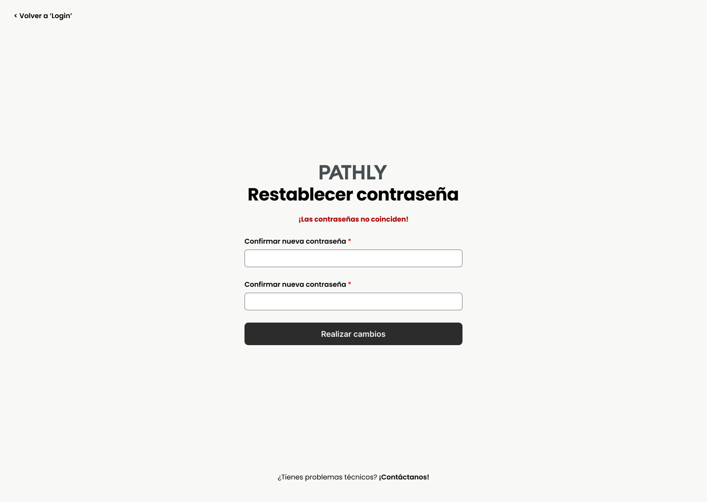
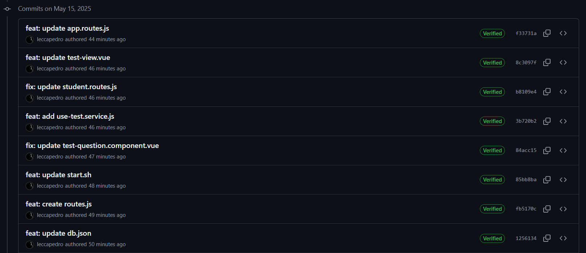

# Universidad Peruana De Ciencas Aplicadas
## SI730 Aplicaciones Web SV51 - Ingeniería de Software

 </img> 

# "Informe de Trabajo Final"
## Docente: Oscar Villafuerte
## Startup: NextStep
## Producto: Pathly
### 2025 - 01
## Relación de integrantes:

* **Quijandria Araneda, Vicente      U201822697**
* **Lecca Villalobos. Pedro Omar     U202223293**
* **Espinoza Chavez, Moises Filemon  U202221383**
* **Geronimo Quispe, Pablo Antonio   U202314304**

---

## Registro de Versiones del Informe

| Versión | Fecha | Autor | Descripción |
|---------|-------|-------|-------------|
| TB1     | 20/04/2025 | Lecca Villalobos, Pedro Omar | Realizó el Capítulo 2 |
| TB1     | 20/04/2025 | Quijandria Araneda, Vicente | Realizó partes del el Capítulo 1 |
| TB1     | 25/04/2025 | Lecca Villalobos, Pedro Omar | Realizó el Capítulo 1 y 3 |
| TB1     | 26/04/2025 | Lecca Villallbos, Pedro Omar | Realizó los puntos 4.3 y 4.4 del capítulo 4 |
| TB1     | 26/04/2025 | Lecca Villalobos, Pedro Omar | Terminó la Landing Page / Web Applications & Wireframes & MockUp |
| TB1     | 26/04/2025 | Geronimo Quispe, Pablo Antonio | Realizó el punto 4.6. |
| TB1     | 26/04/2025 | Espinoza Chávez, Moisés Filemón | Realizó el punto 4.1.1. General Style Guidelines |
| TB1     | 27/04/2025 | Espinoza Chávez, Moisés Filemón | Realizó el punto 4.1.2. Web Style Guidelines |
| TB1     | 27/04/2025 | Espinoza Chávez, Moisés Filemón | Realizó los puntos 4.2.1, 4.2.2, 4.2.3, 4.2.4, 4.2.5 |
| TB1     | 27/04/2025 | Espinoza Chávez, Moisés Filemón | Realizó el punto 5.2.1.5 Execution Evidence for Sprint Review. |
| TB1     | 27/04/2025 | Lecca Villalobos, Pedro Omar | Realizó los puntos 5.1.1 hasta 5.2.1.4, luego 5.2.1.6 hasta 5.2.1.8. |
| TB1     | 27/04/2025 | Lecca Villalobos, Pedro Omar | Realizó las conclusiones, y actualizó el documento. |
| TB1     | 27/04/2025 | Geronimo Quispe, Pablo Antonio | Realizó el punto 4.7 y 4.8 |
| TP      | 15/05/2025 | Quijandria Araneda, Vicente | Realizó el sprint evidence 2 |
| TP      | 16/05/2025 | Geronimo Quispe, Pablo Antonio | Realizó el sprint evidence 2 |
| TP      | 16/05/2025 | Geronimo Quispe, Pablo Antonio | Aplico mejora continua |
| TP      | 16/05/2025 | Lecca Villalobos, Pedro Omar | Realizó el sprint evidence 2 |

## Project Report Collaboration Insights

| URL de la organización del proyecto |             URL del repositorio del reporte            |          URL del repositorio de la landing page             |
|-------------------------------------|--------------------------------------------------------|-------------------------------------------------------------|
| https://github.com/NextStep-UPC     | https://github.com/DevsConClase-PatitaSolidaria/Report | https://github.com/DevsConClase-PatitaSolidaria/LandingPage |

## Contenido

## Tabla de contenidos

- [Registro de Versiones del Informe](#registro-de-versiones-del-informe)
- [Project Report Collaboration Insights](#project-report-collaboration-insights)
- [Student Outcome](#student-outcome)
- [Capítulo I: Introducción](#capítulo-i-introducción)
    - [1.1. Startup Profile](#11-startup-profile)
        - [1.1.1. Descripción de la Startup](#111-descripción-de-la-startup)
        - [1.1.2. Perfiles de integrantes del equipo](#112-perfiles-de-integrantes-del-equipo)
    - [1.2. Solution Profile](#12-solution-profile)
        - [1.2.1. Antecedentes y problemática](#121-antecedentes-y-problemática)
        - [1.2.2. Lean UX Process](#122-lean-ux-process)
        - [1.2.2.1. Lean UX Problem Statements](#1221-lean-ux-problem-statements)
        - [1.2.2.2. Lean UX Assumptions](#1222-lean-ux-assumptions)
        - [1.2.2.3. Lean UX Hypothesis Statements](#1223-lean-ux-hypothesis-statements)
        - [1.2.2.4. Lean UX Canvas](#1224-lean-ux-canvas)
    - [1.3. Segmentos objetivos](#13-segmentos-objetivo)
- [Capítulo II: Requirements Elicitation \& Analysis](#capítulo-ii-requirements-elicitation--analysis)
    - [2.1. Competidores](#21-competidores)
        - [2.1.1. Análisis competitivo](#211-análisis-competitivo)
        - [2.1.2. Estrategias y tácticas frente a competidores](#212-estrategias-y-tácticas-frente-a-competidores)
    - [2.2. Entrevistas](#22-entrevistas)
        - [2.2.1. Diseño de entrevistas](#221-diseño-de-entrevistas)
        - [2.2.2. Registro de entrevistas](#222-registro-de-entrevistas)
        - [2.2.3. Análisis de entrevistas](#223-análisis-de-entrevistas)
    - [2.3. Needfinding](#23-needfinding)
        - [2.3.1. User Personas](#231-user-personas)
        - [2.3.2. User Task Matrix](#232-user-task-matrix)
        - [2.3.3. User Journey Mapping](#233-user-journey-mapping)
        - [2.3.4. Empathy Mapping](#234-empathy-mapping)
        - [2.3.5. As-is Scenario Mapping](#235-as-is-scenario-mapping)
    - [2.4. Ubiquitous Language](#24-ubiquitous-language)
- [Capítulo III: Requirements Specification](#capítulo-iii-requirements-specification)
    - [3.1. To-Be Scenario Mapping](#31-to-be-scenario-mapping)
    - [3.2. User Stories](#32-user-stories)
    - [3.3. Impact Mapping](#33-impact-mapping)
    - [3.4. Product Backlog](#34-product-backlog)
- [Capítulo IV: Product Design](#capítulo-iv-product-design)
    - [4.1. Style Guidelines.](#41-style-guidelines)
        - [4.1.1. General Style Guidelines](#411-general-style-guidelines)
        - [4.1.2. Web Style Guidelines](#412-web-style-guidelines)
    - [4.2. Information Architecture](#42-information-architecture)
        - [4.2.1. Organization Systems](#421-organization-systems)
        - [4.2.2. Labeling Systems](#422-labeling-systems)
        - [4.2.3. SEO Tags and Meta Tags](#423-seo-tags-and-meta-tags)
        - [4.2.4. Searching Systems](#424-searching-systems)
        - [4.2.5. Navigation Systems](#425-navigation-systems)
    - [4.3. Landing Page UI Design](#43-landing-page-ui-design)
        - [4.3.1. Landing Page Wireframe](#431-landing-page-wireframe)
        - [4.3.2. Landing Page Mock-up](#432-landing-page-mock-up)
    - [4.4. Web Applications UX/UI Design](#44-web-applications-uxui-design)
        - [4.4.1. Web Applications Wireframes](#441-web-applications-wireframes)
        - [4.4.2. Web Applications Wireflow Diagrams](#442-web-applications-wireflow-diagrams)
        - [4.4.3. Web Applications Mock-ups](#443-web-applications-mock-ups)
        - [4.4.4. Web Applications User Flow Diagrams](#444-web-applications-user-flow-diagrams)
    - [4.5. Web Applications Prototyping](#45-web-applications-prototyping)
    - [4.6. Domain-Driven Software Architecture](#46-domain-driven-software-architecture)
        - [4.6.1. Software Architecture Context Diagram](#461-software-architecture-context-diagram)
        - [4.6.2. Software Architecture Container Diagrams](#462-software-architecture-container-diagrams)
        - [4.6.3. Software Architecture Components Diagrams](#463-software-architecture-components-diagrams)
    - [4.7. Software Object-Oriented Design](#47-software-object-oriented-design)
        - [4.7.1. Class Diagrams](#471-class-diagrams)
    - [4.8. Database Design](#48-database-design)
        - [4.8.1. Database Diagram](#481-database-diagram)
        - [4.8.2. Database Dictionary](#482-database-dictionary)
- [Capítulo V: Product Implementation, Validation \& Deployment](#capítulo-v-product-implementation-validation--deployment)
    - [5.1. Software Configuration Management](#51-software-configuration-management)
        - [5.1.1. Software Development Environment Configuration](#511-software-development-environment-configuration)
        - [5.1.2. Source Code Management](#512-source-code-management)
        - [5.1.3. Source Code Style Guide \& Conventions](#513-source-code-style-guide--conventions)
        - [5.1.4. Software Deployment Configuration](#514-software-deployment-configuration)
    - [5.2. Landing Page, Services \& Applications Implementation](#52-landing-page-services--applications-implementation)
        - [5.2.1. Sprint 1](#521-sprint-1)
            - [5.2.1.1. Sprint Planning 1](#5211-sprint-planning-1)
            - [5.2.1.2. Sprint Backlog 1](#5212-sprint-backlog-1)
            - [5.2.1.3. Development Evidence for Sprint Review](#5213-development-evidence-for-sprint-review)
            - [5.2.1.4. Testing Suite Evidence for Sprint Review](#5214-testing-suite-evidence-for-sprint-review)
            - [5.2.1.5. Execution Evidence for Sprint Review](#5215-execution-evidence-for-sprint-review)
            - [5.2.1.6. Services Documentation Evidence for Sprint Review](#5216-services-documentation-evidence-for-sprint-review)
            - [5.2.1.7. Software Deployment Evidence for Sprint Review](#5217-software-deployment-evidence-for-sprint-review)
            - [5.2.1.8. Team Collaboration Insights during Sprint](#5218-team-collaboration-insights-during-sprint)
        - [5.2.2. Sprint 2](#521-sprint-1)
            - [5.2.2.1. Sprint Planning 2](#5211-sprint-planning-1)
            - [5.2.2.2. Sprint Backlog 2](#5212-sprint-backlog-1)
            - [5.2.2.3. Development Evidence for Sprint Review](#5213-development-evidence-for-sprint-review)
            - [5.2.2.4. Testing Suite Evidence for Sprint Review](#5214-testing-suite-evidence-for-sprint-review)
            - [5.2.2.5. Execution Evidence for Sprint Review](#5215-execution-evidence-for-sprint-review)
            - [5.2.2.6. Services Documentation Evidence for Sprint Review](#5216-services-documentation-evidence-for-sprint-review)
            - [5.2.2.7. Software Deployment Evidence for Sprint Review](#5217-software-deployment-evidence-for-sprint-review)
            - [5.2.2.8. Team Collaboration Insights during Sprint](#5218-team-collaboration-insights-during-sprint)
- [Conclusiones](#conclusiones)
- [Bibliografía](#bibliografía)
- [Anexos](#anexos)

## Student Outcome

_ABET – EAC - Student Outcome 5_

En el siguiente cuadro se describe las acciones realizadas y enunciados de
conclusiones por parte del grupo, que permiten sustentar el haber alcanzado el logro
del ABET – EAC - Student Outcome 5.

| **Criterio específico** | **Acciones Realizadas** | **Conclusiones** |
|:-------------------------|:------------------------|:-----------------|
| 1. Trabaja en equipo para proporcionar liderazgo | **Lecca Villalobos, Pedro Omar** **TB1:** Realizó el Capítulo 2 completo del informe, redactó el Capítulo 1 (Introducción) y Capítulo 3 (Especificación de Requerimientos), desarrolló los puntos 4.3 y 4.4 (flujos de aplicaciones web), implementó la Landing Page, elaboró wireframes y mockups, completó los puntos 5.1.1 a 5.2.1.4 y de 5.2.1.6 a 5.2.1.8 del Sprint 1, finalizó conclusiones generales y actualizó la versión final del documento.  **Espinoza Chavez, Moises Filemon** **TB1:** Realizó los apartados 4.1.1 (General Style Guidelines) y 4.1.2 (Web Style Guidelines), así como los puntos 4.2.1 a 4.2.5 (estructura visual y navegación). También redactó la sección 5.2.1.5 (Execution Evidence for Sprint Review).  **Geronimo Quispe, Pablo Antonio** **TB1:** Realizó el punto 4.6 (Domain-Driven Software Architecture), contribuyendo a la definición de la arquitectura de componentes y contextos de software.  **Lecca Villalobos, Pedro Omar** **TP1:** Organizó y lideró la planificación del Sprint 2, estructurando el desarrollo del frontend mediante arquitectura DDD y distribución por *bounded contexts*. Implementó funcionalidades clave como la autenticación, recuperación de contraseña y, especialmente, la internacionalización de la plataforma (i18n), configurando los archivos `en.json` y `es.json`, y creando el componente `language-switcher`. Coordinó el trabajo técnico del equipo asegurando cohesión, modularidad y buenas prácticas.  **Quijandria Araneda, Vicente** **TP1:** Fue responsable del desarrollo funcional del test vocacional, diseñando la interfaz de preguntas, lógica de navegación entre secciones, captura de respuestas y visualización de resultados personalizados. También se encargó de aplicar estilos CSS para mejorar la experiencia de usuario, integrando correctamente la funcionalidad en el flujo general del sistema. | El equipo demostró liderazgo distribuido, asignando roles estratégicos de acuerdo con las habilidades de cada integrante. Se logró coordinar eficazmente el desarrollo técnico, visual y documental del proyecto, asegurando que todas las áreas fueran atendidas de manera oportuna y efectiva. |
| 2. Crea un entorno colaborativo, establece metas, planifica tareas y cumple objetivos | **Lecca Villalobos, Pedro Omar** **TB1:** Planificó la estructura de capítulos del informe, organizó los entregables por hitos, implementó y desplegó la Landing Page, realizó pruebas manuales de validación y aseguró el cumplimiento de los objetivos del Sprint 1.  **Espinoza Chavez, Moises Filemon** **TB1:** Propuso criterios de estilo para uniformizar la visualización del proyecto, apoyó la organización y revisión de entregables y cumplió sus asignaciones en los tiempos planificados.  **Geronimo Quispe, Pablo Antonio** **TB1:** Participó en la definición de los artefactos de arquitectura, colaboró en el avance documentado del informe y cumplió con sus entregables dentro de los plazos del Sprint.  **Lecca Villalobos, Pedro Omar** **TP1:** Estableció objetivos técnicos claros, diseñó componentes compartidos reutilizables y aplicó principios de ingeniería de software que facilitaron la implementación simultánea entre contextos. También se encargó del ajuste visual de vistas comunes y del despliegue funcional de las vistas multilenguaje. Dio soporte activo a sus compañeros durante la integración de módulos.  **Quijandria Araneda, Vicente** **TP1:** Coordinó con los demás miembros del equipo la conexión de su módulo con los datos del sistema y las rutas de navegación. Validó el correcto funcionamiento del test vocacional mediante pruebas funcionales y aseguró la presentación clara de resultados. Su participación permitió avanzar con uno de los componentes más visibles del sistema, alineado con los objetivos del Sprint. | El equipo generó un entorno de colaboración efectiva, planificando de manera estructurada las actividades necesarias para el logro de los objetivos propuestos. Se cumplió satisfactoriamente con los tiempos de entrega, manteniendo una comunicación continua y asegurando la calidad de los productos desarrollados. |

# Capítulo I: Introducción

En esta sección describimos el perfil de nuestra Startup.

## 1.1. Startup Profile

### 1.1.1. Descripción de la Startup

Pathly es una startup tecnológica fundada en 2025 por un equipo de estudiantes de Ingeniería de Software de la UPC, orientada a transformar el proceso de orientación vocacional de los jóvenes. Nuestra propuesta principal es una plataforma digital que combina herramientas automatizadas, como test vocacionales confiables, con la orientación personalizada de psicólogos vocacionales certificados.

Pathly nace con el objetivo de atender las necesidades detectadas en estudiantes de 4to y 5to de secundaria: la falta de claridad en la elección de carrera, la presión social y familiar, y la ausencia de un acompañamiento profesional estructurado. Asimismo, se identifica una oportunidad para integrar en el proceso a profesionales de la psicología que buscan nuevas formas de conectar con los adolescentes en su etapa de exploración vocacional.

Nuestra solución se posiciona en un mercado competitivo a través de un modelo dual —estudiantes y psicólogos—, diferenciándose por su enfoque humano, su facilidad de acceso digital, su validación profesional y su orientación continua basada en la experiencia del usuario (UX).

**Misión**  
Ofrecer una solución tecnológica integral que facilite la orientación vocacional de estudiantes de secundaria, combinando test automatizados, recomendaciones personalizadas y acompañamiento profesional certificado, para empoderarlos en la elección de su futuro académico y profesional.

**Visión**  
Convertirnos en la plataforma de referencia en orientación vocacional en Latinoamérica, reconocida por su enfoque humano, tecnológico e innovador, capaz de conectar a los jóvenes con sus verdaderas pasiones, talentos y proyectos de vida.

### 1.1.2. Perfiles de integrantes del equipo

| Foto | Descripción |
|------|-------------|
|  | Estudio la carrera de Ingeniería de Software en la UPC. Me gusta el fútbol, surf, buceo y la tecnología. Soy una persona que siempre busca aprender nuevos conocimientos que me lleven a convertirme en un gran profesional y así poder cumplir mis metas cada día. |
|  | Mi nombre es Pedro Lecca y actualmente estudio la carrera de Ingeniería de Software en la Universidad UPC, sede San Miguel. Tengo 20 años y me considero una persona responsable, comprometida con el cumplimiento de mis deberes académicos. Además, valoro profundamente mantener una buena relación con mi equipo de trabajo, ya que estoy convencido de que un ambiente colaborativo y respetuoso permite alcanzar mejores resultados y potencia el desarrollo colectivo. |
|  | Mi nombre es Moisés Espinoza Chávez, estoy estudiando la carrera de Ingeniería de Software y actualmente me encuentro cursando el quinto ciclo. Me gusta el deporte y mantenerme en constante aprendizaje. Tengo conocimientos en SQL, C++ y un poco de HTML, CSS y JavaScript, así como habilidades para la adaptabilidad y la responsabilidad. |
|  |Mi nombre es Pablo,tengo 19 años y soy estudiante de Ingeniería de Software en la UPC, sede San Miguel. Soy una persona decidida, confiable, responsable y honesta con mi grupo de trabajo ,siendo lo más útil posible. Tengo conocimientos en C++,C# y php. Cada día trato de dar una mejor versión de mi y aprender de mis errores. |   

## 1.2. Solution Profile

### 1.2.1. Antecedentes y Problemática

Aplicando la técnica 5W2H, se identifican las siguientes justificaciones:

- **Who (Quiénes):**  
  El problema afecta principalmente a estudiantes de 4to y 5to de secundaria, quienes atraviesan una etapa crítica de definición vocacional, así como a psicólogos vocacionales que buscan mejorar sus métodos de acompañamiento. Estos estudiantes, en su mayoría adolescentes de entre 15 y 18 años, enfrentan presiones externas de familiares, colegios y la sociedad para definir su futuro profesional en un corto plazo. Por su parte, los psicólogos tienen limitaciones de tiempo, herramientas y plataformas que dificultan una orientación efectiva, perdiendo oportunidades de seguimiento y personalización.

- **What (Qué):**  
  Existe una necesidad urgente de un proceso de orientación vocacional que sea estructurado, personalizado y tecnológicamente accesible. Actualmente, la mayoría de los estudiantes solo tiene acceso a test vocacionales genéricos, poco adaptados a su realidad personal, y que carecen de un verdadero acompañamiento posterior. Además, se observa que las decisiones de carrera se toman con información incompleta o bajo presión social, sin explorar a fondo intereses, habilidades y vocaciones reales. Esto puede derivar en deserción universitaria, frustración profesional y pérdida de años académicos valiosos.

- **Where (Dónde):**  
  La problemática se presenta en todo el territorio peruano, pero es especialmente visible en zonas urbanas y semiurbanas donde, a pesar de contar con acceso a internet y dispositivos digitales, las instituciones educativas no disponen de programas integrales de orientación vocacional. Muchos colegios carecen de especialistas dedicados exclusivamente a este proceso, delegándolo en psicólogos escolares generalistas que también deben atender temas conductuales, familiares y emocionales, reduciendo el tiempo y la calidad de la orientación vocacional.

- **When (Cuándo):**  
  El momento más crítico en el que se manifiesta esta necesidad es durante el cuarto y quinto año de secundaria. Es en esta etapa donde los estudiantes empiezan a considerar seriamente sus opciones de estudios superiores y de carrera, influenciados por ferias educativas, admisiones universitarias y expectativas familiares. Sin embargo, muchos enfrentan estos momentos cruciales sin contar con un autoconocimiento profundo, herramientas de decisión, o asesoría vocacional especializada, lo que aumenta la probabilidad de tomar decisiones apresuradas o erróneas.

- **Why (Por qué):**  
  El problema persiste porque los procesos de orientación vocacional en el país son fragmentados, insuficientes y en muchos casos inexistentes. Predomina el uso de métodos tradicionales poco actualizados, como test impresos obsoletos, sin adaptaciones a la realidad cambiante de nuevas carreras o tendencias profesionales emergentes. Además, la falta de articulación entre estudiantes, familias y orientadores genera un vacío de acompañamiento emocional y profesional. La ausencia de plataformas que combinen asesoría personalizada y tecnología accesible deja a los jóvenes sin un soporte integral para su desarrollo vocacional.

- **How (Cómo):**  
  La solución planteada es el desarrollo de una plataforma digital que combine:
  - Test vocacionales modernos, interactivos y adaptables a nuevos perfiles profesionales.
  - Un sistema de conexión directa con psicólogos certificados especializados en orientación vocacional.
  - Espacios de seguimiento y retroalimentación continua para evaluar el avance del estudiante en su autoconocimiento.
  - Recursos educativos complementarios, como videos, talleres virtuales y foros de exploración vocacional.
  La plataforma será de fácil acceso tanto desde web como dispositivos móviles, garantizando una experiencia amigable, intuitiva y segura para los adolescentes.

- **How much (Cuánto):**  
  Se propone un modelo de negocio freemium, en el cual los estudiantes puedan acceder gratuitamente a las funcionalidades básicas como el test inicial y contenidos educativos, y optar por planes de pago accesibles para sesiones personalizadas o asesorías avanzadas. Este modelo garantiza la inclusión de un mayor número de usuarios, permitiendo también que colegios puedan adoptar el servicio mediante convenios institucionales para sus estudiantes, democratizando el acceso a una orientación vocacional de calidad.

### 1.2.2. Lean UX Process

#### 1.2.2.1. Lean UX Problem Statements

En el Perú, miles de estudiantes de secundaria enfrentan cada año el desafío de elegir una carrera profesional en un contexto cargado de presión social, expectativas familiares y desinformación. Aunque la orientación vocacional debería ser un proceso guiado y reflexivo, en la práctica escolar se ofrece de forma superficial, fragmentada o está ausente por completo.

Muchos colegios carecen de programas estructurados de orientación vocacional y se limitan a ofrecer test genéricos que no consideran los intereses, contextos ni capacidades individuales. Esta carencia deja a los adolescentes expuestos a tomar decisiones críticas sin autoconocimiento suficiente ni apoyo profesional, lo que puede derivar en frustración académica, deserción o cambios tardíos de carrera.

Paralelamente, los psicólogos vocacionales enfrentan obstáculos como falta de tiempo, exceso de demanda y escasez de herramientas actualizadas, lo cual dificulta brindar un proceso profundo y continuo. La falta de canales eficientes para el seguimiento también debilita la relación entre el profesional y el estudiante.

Las entrevistas realizadas revelan que tanto estudiantes como psicólogos perciben esta situación como una limitación significativa y manifiestan el deseo de contar con un proceso más empático, accesible, estructurado y sostenido en el tiempo.

#### 1.2.2.2. Lean UX Assumptions

A partir de la problemática detectada y el análisis de usuarios, se establecen las siguientes suposiciones clave que guían el desarrollo inicial de Pathly:

**Suposiciones sobre estudiantes de secundaria:**

- Suponemos que los estudiantes de 4to y 5to de secundaria no tienen claro qué carrera elegir y necesitan herramientas confiables para conocerse mejor.
- Suponemos que valoran la opinión de sus padres y profesores, pero buscan decidir por sí mismos con mayor seguridad.
- Suponemos que muchos han realizado test vocacionales genéricos en internet, pero no confían del todo en sus resultados.
- Suponemos que prefieren plataformas visuales, intuitivas y móviles, debido a su afinidad con la tecnología y el uso cotidiano de redes sociales.
- Suponemos que los estudiantes se sienten más cómodos si pueden acceder a orientación desde casa o fuera del horario escolar.

**Suposiciones sobre psicólogos vocacionales:**

- Suponemos que los psicólogos escolares y vocacionales desean llegar a más estudiantes sin sacrificar la calidad del proceso.
- Suponemos que necesitan herramientas digitales que integren test, historial y seguimiento de los casos en una misma plataforma.
- Suponemos que valoran mantener el contacto humano, pero estarían dispuestos a usar una plataforma si mejora la gestión y organización de su trabajo.
- Suponemos que prefieren trabajar en entornos donde puedan validar su experiencia profesional, generar reputación y recibir retroalimentación.

**Suposiciones sobre el entorno digital:**

- Suponemos que una plataforma digital debe ofrecer **resultados de test personalizables, acompañados de recomendaciones prácticas y claras.
- Suponemos que la solución debe incluir funciones de contacto directo entre estudiante y orientador (como chat o videollamada).
- Suponemos que un modelo freemium permitiría captar usuarios sin barreras económicas, y que un sistema de perfiles motivaría el uso frecuente.

---

**User Outcomes:**

- Que los estudiantes descubran con mayor claridad sus intereses, habilidades y opciones de carrera.
- Que tomen decisiones vocacionales con mayor seguridad y menor presión externa.
- Que puedan acceder a orientación personalizada sin importar limitaciones geográficas o económicas.
- Que los psicólogos logren mejorar su capacidad de seguimiento, organización y calidad en el proceso de orientación.

---

**Business Outcomes:**

- Lograr una alta adopción inicial entre estudiantes de secundaria y psicólogos vocacionales.
- Generar alianzas con instituciones educativas para implementar Pathly como herramienta oficial de orientación.
- Incrementar la conversión de usuarios gratuitos a planes de pago mediante valor percibido.
- Construir una red profesional sólida que refuerce la confianza y reputación de la plataforma.

#### 1.2.2.3. Lean UX Hypothesis Statements

A partir de nuestras asunciones, formulamos las siguientes hipótesis que deben ser validadas con usuarios reales:

1. **Creemos que los estudiantes de secundaria necesitan una forma clara y accesible de entender su vocación**  
   porque actualmente enfrentan confusión y presión al tomar decisiones sin acompañamiento profesional,  
   entonces, si les ofrecemos una plataforma con test guiados y sesiones con orientadores certificados,  
   aumentará su claridad y confianza en la elección de carrera.

2. **Creemos que los psicólogos vocacionales necesitan una herramienta para organizar y dar seguimiento a sus orientaciones**  
   porque ahora trabajan con recursos dispersos y tiempo limitado,  
   entonces, si les damos un panel de gestión de citas, historial de estudiantes y comunicación integrada,  
   podrán atender más casos sin sacrificar calidad.

3. **Creemos que una plataforma digital con enfoque visual e interactivo motivará a los estudiantes a iniciar su proceso vocacional**  
   porque están habituados al uso de tecnología, redes sociales y contenidos breves,  
   entonces, si Pathly integra una experiencia de usuario fluida y amigable,  
   se incrementará la frecuencia de uso y retención en la plataforma.

4. **Creemos que permitir el contacto directo entre estudiante y orientador aumentará la percepción de valor de la plataforma**  
   porque actualmente los estudiantes sienten que nadie les da seguimiento personalizado,  
   entonces, si ofrecemos opciones como chat o videollamada,  
   los usuarios confiarán más en la herramienta y en los resultados del proceso.

5. **Creemos que un modelo freemium con test gratuitos y orientación opcional de pago**  
   permitirá democratizar el acceso a la orientación vocacional,  
   entonces, si ofrecemos una experiencia de valor desde el primer uso,  
   lograremos atraer usuarios y convertirlos en clientes recurrentes.

Estas hipótesis serán validadas mediante pruebas con usuarios, entrevistas, prototipos y análisis de métricas de uso.

#### 1.2.2.4. Lean UX Canvas

## 1.3. Segmentos objetivo

Esta sección incluye la descripción de los segmentos asociados al dominio del problema, incluyendo características demográficas e información estadística de sustento.

A partir de la investigación realizada, se han identificado dos segmentos clave para el desarrollo de Pathly. Ambos representan actores principales en el proceso de orientación vocacional y han sido seleccionados debido a su influencia directa en la toma de decisiones académicas y su apertura al uso de herramientas digitales.

---

#### 1. Estudiantes de secundaria (4to y 5to año)

Este grupo está compuesto por adolescentes entre 15 y 18 años, que cursan los últimos años de educación secundaria. Según datos del Ministerio de Educación del Perú (MINEDU), más de 600 mil jóvenes transitan por este nivel cada año, siendo un grupo clave en el sistema educativo. La mayoría de estos estudiantes aún no define claramente una opción profesional, y lo hace influido por el entorno familiar, social o por presión institucional.

**Características clave:**

- Edad: entre 15 y 18 años  
- Escolaridad: 4to y 5to año de secundaria  
- Acceso digital: uso frecuente de celulares, redes sociales y Google  
- Intereses: contenidos interactivos, autoconocimiento, seguridad en sus decisiones  
- Comportamiento: búsqueda informal de información vocacional, presión por decidir, falta de orientación profesional continua

**Necesidades detectadas:**

- Herramientas accesibles que ayuden a explorar intereses, habilidades y opciones de carrera
- Procesos guiados y personalizados que acompañen la decisión vocacional
- Apoyo profesional que puedan entender y con el que se sientan escuchados

---

#### 2. Psicólogos vocacionales certificados

Este segmento está conformado por profesionales de la psicología que trabajan en instituciones educativas, consultorías privadas o de manera independiente. En el Perú, según SUNEDU, hay más de 70 mil psicólogos licenciados, de los cuales una parte importante trabaja en entornos escolares. Sin embargo, la mayoría no cuenta con herramientas digitales integradas para procesos vocacionales, ni con plataformas que conecten eficientemente con estudiantes.

**Características clave:**

- Profesión: psicólogos con especialización en orientación vocacional
- Modalidad de trabajo: presencial o virtual, en instituciones o de forma independiente
- Dificultades: alta carga laboral, procesos manuales, falta de seguimiento estructurado
- Intereses: plataformas que les permitan gestionar casos, agendar sesiones, brindar seguimiento y construir una reputación profesional validada

**Necesidades detectadas:**

- Acceder a un entorno digital donde puedan realizar test, seguimiento e interpretación de resultados
- Gestionar múltiples estudiantes de manera organizada y segura
- Participar de una red profesional confiable que potencie su impacto educativo

---

Ambos segmentos fueron validados mediante entrevistas, arquetipos, matrices de tareas y mapeos de experiencia. Pathly busca atender estas necesidades de forma conjunta, articulando tecnología con acompañamiento humano para transformar la orientación vocacional en una experiencia más efectiva, cercana y equitativa.

# Capítulo II: Requirements Elicitation & Analysis

## 2.1. Competidores

### 2.1.1. Análisis competitivo

#### ¿Por qué llevar a cabo este análisis?

Este análisis busca comprender el posicionamiento de **Pathly** en comparación con otras plataformas que ofrecen servicios relacionados a la orientación vocacional y el acompañamiento psicológico, identificando oportunidades de mejora y diferenciación frente a las necesidades de nuestros segmentos objetivos: estudiantes de secundaria (4to y 5to año) y profesionales certificados en psicología y consejería vocacional.

---

### Competitive Analysis Landscape

| **Categoría** | **Pathly** | **Psyalive** | **Orienta.me** | **Oriéntate** |
|--------------|------------|--------------|----------------|----------------|
| **Perfil** |||||
| **Overview** | Plataforma digital que ofrece orientación vocacional a estudiantes mediante test vocacionales, recomendaciones personalizadas y acompañamiento profesional. | Plataforma de psicología online que conecta pacientes con psicólogos licenciados. | Plataforma de asistencia integral (PAE) con enfoque en bienestar emocional, legal y médico. | Web especializada en orientación vocacional a través de tests interactivos y recursos educativos. |
| **Ventaja competitiva / Valor** | Enfoque dual: atención a estudiantes y trabajo conjunto con psicólogos certificados; integra evaluación automatizada con orientación personalizada. | Atención psicológica personalizada y confidencial en múltiples horarios. | Atención integral 24/7 para usuarios corporativos afiliados. | Foco 100% en vocación con tests y recursos didácticos para jóvenes. |
| **Perfil de Marketing** |||||
| **Mercado objetivo** | Estudiantes de 4to y 5to de secundaria, y psicólogos vocacionales certificados interesados en conectar con jóvenes. | Adultos y jóvenes con necesidades psicológicas, en general. | Empleados de empresas afiliadas a servicios de PAE. | Estudiantes de secundaria que buscan orientación vocacional en línea. |
| **Estrategias de marketing** | Alianzas con colegios, redes sociales dirigidas a escolares y posicionamiento como herramienta profesional para psicólogos. | SEO, pauta en redes, testimonios de usuarios. | Convenios corporativos y promoción interna. | Posicionamiento en buscadores y portales educativos. |
| **Perfil de Producto** |||||
| **Productos & Servicios** | Tests vocacionales + guía profesional en línea + recomendaciones personalizadas + red de psicólogos. | Terapia psicológica por videollamada o chat. | Orientación emocional, legal, médica y vocacional (limitada). | Tests vocacionales, recursos educativos y orientación automática. |
| **Precios & Costos** | Freemium: acceso gratuito al test, pagos por sesiones y paquetes con profesionales. | Tarifa por sesión (entre $20–$50 aprox.). | Costo cubierto por empresa afiliada. | Mayoritariamente gratuito con opciones premium. |
| **Canales de distribución (Web/Móvil)** | Web responsive y futura app móvil. | Web y app móvil. | Web y app móvil. | Solo Web. |

---

### Análisis SWOT

| **SWOT**        | **Pathly** | **Psyalive** | **Orienta.me** | **Oriéntate** |
|----------------|------------|--------------|----------------|----------------|
| **Fortalezas** | Modelo dual: estudiantes + red de psicólogos; enfoque vocacional claro; diseño UX. | Psicólogos licenciados; alta disponibilidad. | Cobertura 24/7; servicios integrales. | Interfaz sencilla y enfoque claro en vocación. |
| **Debilidades** | Startup nueva, sin reputación consolidada. | No ofrece orientación vocacional. | No enfocado en estudiantes ni orientación educativa. | Sin acompañamiento profesional. |
| **Oportunidades** | Trabajar con colegios y profesionales independientes. | Ampliar vertical educativa. | Expandirse a población estudiantil. | Incluir red de psicólogos. |
| **Amenazas** | Mayor experiencia y recursos de la competencia. | Pérdida de cuota frente a plataformas educativas. | Cambios en necesidades de los jóvenes. | Avance de soluciones híbridas más completas. |

## 2.1.2. Estrategias y tácticas frente a competidores

En base al análisis competitivo, se han definido estrategias que permitirán a **Pathly** posicionarse efectivamente frente a otras plataformas, atendiendo tanto a estudiantes de secundaria como a psicólogos vocacionales certificados.

### Estrategias

- **Modelo colaborativo estudiante-profesional**: Ofrecer una experiencia integrada donde los psicólogos certificados puedan atender directamente a los estudiantes luego del test vocacional.

- **Especialización en segmento escolar**: Construir Pathly como la plataforma de referencia para estudiantes de secundaria que requieren apoyo en su decisión vocacional.

- **Facilidad de acceso digital**: Mantener una interfaz amigable, accesible desde dispositivos móviles, sin barreras técnicas o económicas para el estudiante.

- **Red profesional de confianza**: Filtrar y certificar a los psicólogos que participan en la plataforma, brindando seguridad y respaldo institucional.

### Tácticas

- **Plataforma freemium dirigida a estudiantes**: Test gratuito con acceso opcional a orientación profesional pagada. Esto permite captar usuarios y monetizar progresivamente.

- **Campañas educativas y testimonios reales**: Promover la orientación vocacional en redes sociales mediante historias de estudiantes y psicólogos.

- **Alianzas con instituciones educativas**: Establecer convenios con colegios para ofrecer Pathly como recurso oficial.

- **Panel para profesionales**: Crear una interfaz especial para psicólogos certificados donde puedan gestionar citas, dar seguimiento y comunicarse con estudiantes.

- **Mejoras iterativas basadas en entrevistas**: Validar la plataforma en campo con ambos segmentos objetivo y adaptar funciones según sus necesidades reales.

## 2.2. Entrevistas

### 2.2.1. Diseño de entrevistas

Para diseñar entrevistas efectivas se han definido dos bloques de preguntas diferenciadas por segmento, aplicando buenas prácticas como: preguntas abiertas, lenguaje claro, tono amigable y estructura flexible.

El objetivo principal es obtener información clave para construir arquetipos sólidos, considerando variables demográficas, psicológicas y de comportamiento digital, además de motivaciones, frustraciones y necesidades.

### Segmento 1: Estudiantes de 4to y 5to de secundaria

#### Objetivo
Comprender su contexto académico, intereses, uso de tecnología, nivel de conocimiento sobre orientación vocacional y sus expectativas frente a una posible plataforma digital como Pathly.

#### Preguntas principales
1. ¿En qué grado estás y en qué colegio estudias?
2. ¿Qué tanto conoces sobre orientación vocacional?
3. ¿Has hecho antes algún test vocacional? ¿Cómo fue tu experiencia?
4. ¿Qué esperas encontrar en una plataforma que te ayude a elegir tu carrera?
5. ¿Cómo tomas decisiones importantes como elegir una carrera?
6. ¿Conversas con tus padres, profesores o psicólogos sobre tu futuro profesional?
7. ¿Qué tipo de contenido te gusta ver en internet y en qué plataformas pasas más tiempo?
8. ¿Prefieres usar una app o una página web cuando necesitas buscar algo útil?

#### Preguntas complementarias
- ¿Qué materias o actividades disfrutas más en el colegio?
- ¿Qué carrera(s) te interesan y por qué?
- ¿Qué cosas te frustran cuando piensas en tu futuro?
- ¿Has sentido presión por decidir tu carrera demasiado pronto?
- ¿Qué tan fácil sería para ti acceder a una videollamada con un psicólogo?

---

### Segmento 2: Psicólogos y consejeros vocacionales certificados

#### Objetivo
Conocer su experiencia en orientación vocacional, métodos de trabajo actuales, disposición a usar plataformas digitales, y sus necesidades para trabajar con adolescentes.

#### Preguntas principales
1. ¿Qué experiencia tienes en el campo de la orientación vocacional?
2. ¿Trabajas actualmente con estudiantes escolares? ¿Cómo suelen llegar a ti?
3. ¿Qué herramientas usas para evaluar vocación y tomar decisiones con los estudiantes?
4. ¿Qué opinas del uso de test vocacionales automatizados?
5. ¿Qué elementos consideras clave en una buena orientación vocacional?
6. ¿Estarías dispuesto a brindar servicios a través de una plataforma como Pathly?
7. ¿Qué características debería tener una plataforma para facilitar tu trabajo?
8. ¿Qué problemas enfrentas al trabajar con adolescentes en orientación vocacional?

#### Preguntas complementarias
- ¿Tienes experiencia con plataformas digitales o teleorientación?
- ¿Qué tipo de comunicación prefieres con los estudiantes (videollamada, chat, correo)?
- ¿Qué tipo de seguimiento realizas después de la orientación?
- ¿Te gustaría acceder a un panel de gestión de usuarios?
- ¿Qué tan dispuesto estás a trabajar en un sistema con validación y reputación profesional?

### 2.2.2. Registro de entrevistas
**Segmento 1:Jóvenes estudiantes de 15 - 19 años**

**Entrevista N°1: Adrian Valera**
- Sexo: Masculino
- Edad: 17 años
- Ubicación en la que vive olivos, Lima, Perú  

- Link: https://drive.google.com/file/d/1ytI4TQHYi9yd6shk1knVcFKFqv8wHry7/view?usp=drive_link
- Momento en el que inicia: 0:02
- Duración: 7:07

**Resumen:**
Adrian Valera es un chico de 5to grado de secundaria que aun no ha escogido una carrera ya que tiene el temor de que sea una opcion incorrecta  a las preguntas propuestas que ha tenido  muy poco acercamiento a los test vocacionales onlinne pero si ha llevado en lugares con psicologos y no ha sido de su agrado ya que a el le gustaria ver un poco mas de informacion y que el psicologo siga su orientacion paso por paso para que pueda escoger una carrera de acuerdo a su test vocacional ,con la pregunta de servicios a traves de una plataforma el se sintio muy agusto que tuviera esa facilidad para poder interactuar con test vocacional y un psicologo que 
lo ayude en ese proceso y que le gustaria estudiar psicologia. 

**Entrevista N°2: Anyelo Alejos**
- Sexo: Masculino
- Edad: 17 años
- Ubicación en la que vive Independencia, Lima, Perú

    
**Entrevista**:
- Link: https://upcedupe-my.sharepoint.com/:v:/g/personal/u202314304_upc_edu_pe/EZ3MnphrLQ5DrRb7NmGPEZEBDl3JarEgirlFJFtvqdAkZw?e=YOkBkE&nav=eyJyZWZlcnJhbEluZm8iOnsicmVmZXJyYWxBcHAiOiJTdHJlYW1XZWJBcHAiLCJyZWZlcnJhbFZpZXciOiJTaGFyZURpYWxvZy1MaW5rIiwicmVmZXJyYWxBcHBQbGF0Zm9ybSI6IldlYiIsInJlZmVycmFsTW9kZSI6InZpZXcifSwicGxheWJhY2tPcHRpb25zIjp7InN0YXJ0VGltZUluU2Vjb25kcyI6Mi4yNn19
- Momento en el que inicia: 0:02
- Duración: 5:55
  **Entrevista N°3: Piero Tenorio**
  - Sexo: Masculino
  - Edad: 17 años
  - Ubicación en la que vive San Miguel, Lima, Perú

    
**Entrevista**:
- link: https://upcedupe-my.sharepoint.com/:v:/g/personal/u202314304_upc_edu_pe/EZ72K_vbEyRNifUIwye0XYoBayn9JnUzIor_XMr0QY8Wfg?e=hopDKG&nav=eyJyZWZlcnJhbEluZm8iOnsicmVmZXJyYWxBcHAiOiJTdHJlYW1XZWJBcHAiLCJyZWZlcnJhbFZpZXciOiJTaGFyZURpYWxvZy1MaW5rIiwicmVmZXJyYWxBcHBQbGF0Zm9ybSI6IldlYiIsInJlZmVycmFsTW9kZSI6InZpZXcifX0%3D
- Momento en el que inicia: 0:00
- Duración: 4:58

**Resumen:**
Piero tenorio nos cuenta un poco como es pasar la vida de un estudiante en 5to de secundaria que ha repetido pero que sigue intentado ya su ultimo año de las preguntas hechas nos dijo que el nunca ha hecho un test vocacional y que aun no tiene algo previsto pero que aun asi le gustaria probar una nueva forma para que el pueda conseguir 
un futuro prometedor que tanto anhela.

***Segmento 2:Psicólogos enfocados en orientación vocacional***

**Entrevista N°1: Maricielo Rugel**
- Sexo: Femenino
- Edad: 23 años
- Ubicación en la que vive olivos, Lima, Perú

 

  
  **Entrevista:**
  link:https://upcedupe-my.sharepoint.com/:v:/g/personal/u202314304_upc_edu_pe/EcVMA4GvuX5PiYD6y-ZQDQoBMpOEFHInTl34d-NKVHWzAA?e=Xkc9TW
- Momento en el que inicia: 0:00
- Duración: 7:49
  
**Resumen:**
Maricielo es licenciada en Psicología y cuenta con experiencia trabajando en el área de orientación vocacional para estudiantes. Actualmente, se desempeña en el sector de Recursos Humanos, pero conserva un fuerte interés por los procesos de acompañamiento a jóvenes que están en búsqueda de su vocación.
Durante nuestra conversación, Maricielo nos compartió información valiosa sobre cómo se orienta a los estudiantes que aún no han iniciado un proceso vocacional o que no están familiarizados con los test vocacionales. Nos explicó detalladamente el paso a paso que debería seguir un estudiante para realizar un test vocacional de manera adecuada, desde la preparación previa hasta la interpretación de resultados con apoyo profesional.
Además, resaltó que una plataforma vocacional debería contar con un sistema de comunicación rápido y eficaz entre el estudiante y el orientador, para garantizar una mejor conexión y acompañamiento personalizado. También hizo énfasis en que, para generar confianza en el producto, sería fundamental implementar un sistema de filtrado o validación de profesionales, que asegure que quienes orientan a los estudiantes cuenten con la preparación y experiencia necesarias.
Su perspectiva refuerza la importancia de unir la tecnología con un enfoque humano y profesional para ofrecer una experiencia vocacional confiable, útil y accesible.

**Entrevista N°2:  Antonella Rugel**
- Sexo: Femenino
- Edad: 28 años
- Ubicación en la que vive olivos, Lima, Perú

 
 
 **Entrevista:**
link:https://upcedupe-my.sharepoint.com/:v:/g/personal/u202314304_upc_edu_pe/EfgU6lkVBSdAu4djjhTMSGABFNyjN-QAbxvux7EK8lC03w?e=HzHUxX&nav=eyJyZWZlcnJhbEluZm8iOnsicmVmZXJyYWxBcHAiOiJTdHJlYW1XZWJBcHAiLCJyZWZlcnJhbFZpZXciOiJTaGFyZURpYWxvZy1MaW5rIiwicmVmZXJyYWxBcHBQbGF0Zm9ybSI6IldlYiIsInJlZmVycmFsTW9kZSI6InZpZXcifX0%3D
- Momento en el que inicia: 0:00
-Duración: 7:49

**Resumen:**
Antonella Rugel es licenciada en Psicología y actualmente se desempeña en el área de salud psicológica. Cuenta con más de tres años de experiencia brindando orientación a jóvenes en la búsqueda de su vocación, utilizando herramientas como los test de Holland y Kuder.
Sin embargo, Antonella nos comentó que, a pesar de ser herramientas útiles, estos test presentan una limitación importante: no incluyen todas las carreras que existen actualmente, lo que puede restringir las opciones para los estudiantes y limitar su visión sobre el amplio abanico de posibilidades profesionales.
Durante su experiencia, ha observado que las carreras que los jóvenes suelen descartar con mayor frecuencia son las relacionadas con humanidades, así como algunas otras que, en muchos casos, no cuentan con la aprobación o respaldo de sus padres. En contraste, las carreras que suelen tener más interés y demanda son aquellas vinculadas a las ingenierías, la medicina y la arquitectura, debido a su prestigio social y las expectativas familiares.
Antonella también resaltó la importancia del rol que cumplen los padres en este proceso, ya que, en varias situaciones, no solo se orienta al estudiante, sino que también se trabaja con la familia para que exista un entendimiento y acompañamiento adecuado.En algunos casos la desinformación de los jóvenes puede ser muy preocupante para los psicólogos al evaluarlos.

  **Entrevista N°3: Marcos Contreras**
  - Sexo: Masculino
  - Edad: 24 años
  - Ubicación en la que vive Independencia, Lima, Perú
    
    

**Entrevista**:
- link: https://upcedupe-my.sharepoint.com/:v:/g/personal/u202314304_upc_edu_pe/Eb72kDMH6gNHt9tAQhgZkZYBXCf9tGGwbrpUYmwE7SYbDA?e=wrH5Qu&nav=eyJyZWZlcnJhbEluZm8iOnsicmVmZXJyYWxBcHAiOiJTdHJlYW1XZWJBcHAiLCJyZWZlcnJhbFZpZXciOiJTaGFyZURpYWxvZy1MaW5rIiwicmVmZXJyYWxBcHBQbGF0Zm9ybSI6IldlYiIsInJlZmVycmFsTW9kZSI6InZpZXcifSwicGxheWJhY2tPcHRpb25zIjp7InN0YXJ0VGltZUluU2Vjb25kcyI6MS45Nn19
  
- Momento en el que inicia: 0:02
- Duración: 4:24

**Resumen:**
Marcos Contreras es egresado de la carrera de Psicología y actualmente trabaja en el área de orientación vocacional, especialmente con estudiantes escolares. Durante la entrevista, mencionó que suele atender a los alumnos tanto de manera presencial como virtual, y que muchos llegan a él por recomendación institucional o familiar. Utiliza diversas herramientas para evaluar la vocación, como entrevistas, test psicométricos y dinámicas de autoconocimiento. Está abierto al uso de plataformas digitales automatizadas siempre que estas sirvan de apoyo y no reemplacen la interacción humana esencial en estos procesos. Mostró disposición a ofrecer sus servicios a través de una plataforma como PG, especialmente si cuenta con funciones que faciliten la gestión y seguimiento de estudiantes.

Sobre los desafíos que enfrenta, comentó que muchos adolescentes sienten incomodidad al expresarse o no toman con seriedad los procesos vocacionales, lo que dificulta una orientación efectiva. Considera clave que una plataforma incluya recursos visuales, interacción personalizada, y un panel de gestión donde pueda dar seguimiento a cada estudiante. Tiene experiencia con herramientas digitales y prefiere comunicarse con los alumnos por videollamada o chat, ya que le permite una relación más cercana. Además, mencionó que realiza seguimientos posteriores a las sesiones, y que le sería muy útil una plataforma que le permita organizar su base de usuarios y gestionar sus casos en un solo lugar.

### 2.2.3. Análisis de entrevistas

 ***Segmento 1:Jóvenes estudiantes de 15 - 19 años***
  **Entrevista 1**:
  Adrián nos comentó que le gustaría contar con una plataforma de orientación vocacional, siempre y cuando esta cuente con certificaciones oficiales y ofrezca una guía personalizada durante todo el proceso. Además, señaló que los test vocacionales en formato físico que ha realizado anteriormente no le han resultado útiles ni satisfactorios, por lo que considera que una plataforma bien estructurada y acompañada por profesionales podría brindarle mayor confianza y mejores resultados.
  **Entrevista 2**:
Angelo es un joven que busca herramientas digitales accesibles, interactivas y con un toque personal para guiarlo en su exploración vocacional, por lo que una plataforma que combine tecnología con interacción humana sería una solución ideal para su caso.
**Entrevista 3**:
Piero sigue motivado por el deseo de construir un futuro prometedor, lo que denota resiliencia y un enfoque positivo hacia los desafíos que enfrenta. La falta de un plan claro no le impide seguir intentando, lo que refleja un deseo de exploración y adaptación en busca de una forma de asegurar su éxito en el futuro. En resumen, Piero se encuentra en una etapa de indecisión, pero con una disposición para descubrir nuevas oportunidades que lo lleven a alcanzar sus metas.

 

 

***Segmento 2:Psicólogos enfocados en orientación vocacional***
**Entrevista N°1:**
Maricielo ofrece una perspectiva valiosa que resalta la importancia de una orientación vocacional estructurada y profesional, en la que los estudiantes reciban un acompañamiento cercano y personalizado. Coincide con otros entrevistados en la necesidad de contar con canales de comunicación eficientes y un seguimiento adecuado, además de la relevancia de un sistema de validación de profesionales que garantice la calidad del servicio.

**Entrevista N°2:**
Antonella nos comento que quisiera una plataforma digital que combine herramientas de orientación vocacional actualizadas, seguimiento personalizado y la posibilidad de involucrar a las familias podría ser una solución integral que potencie el trabajo de psicólogos como Antonella y Marcos. Esto permitiría que los jóvenes tengan acceso a información relevante, interactúen con expertos de manera accesible y, lo más importante, reciban un apoyo adecuado tanto de los profesionales como de sus familias.
**Entrevista N°3:**
Marcos es un profesional con un enfoque integrador y abierto a la innovación tecnológica, siempre que estas herramientas respeten la importancia de la interacción personal y ayuden a mejorar la experiencia de orientación vocacional de los estudiantes.

## 2.3. Needfinding

### 2.3.1. User Personas

Esta sección presenta dos arquetipos desarrollados para representar a los segmentos objetivos de Pathly: estudiantes de secundaria y profesionales de la orientación vocacional.

### User Persona: Estudiante de secundaria

**Nombre**: Mariana Espinoza  
**Edad**: 16 años  
**Género**: Femenino  
**Grado**: 5to de secundaria  
**Ubicación**: Villa El Salvador, Lima  
**Tipo de institución**: Colegio nacional  
**Acceso digital**: Celular propio con acceso a datos móviles y Wi-Fi en casa  

**Objetivos**:
- Descubrir qué carrera se adapta mejor a sus gustos e intereses.
- Entender qué pasos debe seguir después del colegio.

**Frustraciones**:
- Siente presión familiar para decidir su futuro sin orientación clara.
- Le cuesta identificar sus habilidades fuertes.
- Le confunde la cantidad de información que encuentra en internet.

**Habilidades y fortalezas**:
- Buen desempeño en cursos de comunicación y arte.
- Actitud reflexiva y empática.
- Curiosa, usuaria activa de redes sociales.

**Canales digitales preferidos**:
- TikTok, Instagram, YouTube  
- Prefiere contenido audiovisual e interactivo.
  
---

### User Persona: Psicóloga vocacional

**Nombre**: Carla Huamán  
**Edad**: 35 años  
**Profesión**: Psicóloga con especialización en orientación vocacional  
**Ubicación**: Arequipa, Perú  
**Experiencia**: 10 años trabajando con escolares en colegios privados y de convenio  
**Canales de atención actuales**: Sesiones presenciales y ocasionalmente por Zoom  
**Acceso digital**: Laptop y celular con buena conectividad  

**Objetivos**:
- Llegar a más estudiantes con orientación de calidad.
- Utilizar herramientas digitales que faciliten su trabajo.
- Establecer un canal confiable donde pueda organizar citas y hacer seguimiento.

**Frustraciones**:
- Limitaciones de tiempo para cada alumno en colegios.
- Falta de herramientas unificadas para evaluación vocacional.
- Resistencia de algunos padres al uso de plataformas digitales.

**Habilidades y fortalezas**:
- Alta empatía y experiencia guiando adolescentes.
- Capacidad para adaptar el lenguaje y generar confianza.
- Manejo fluido de recursos digitales educativos.

**Canales digitales preferidos**:
- Zoom, WhatsApp, Google Forms  
- Le interesan plataformas con agenda integrada y ficha por estudiante.

### 2.3.2. User Task Matrix

Los segmentos considerados son:
- **Estudiante de secundaria (Mariana Espinoza)**
- **Psicóloga vocacional (Carla Huamán)**

### Matriz de tareas por User Persona

| **Tarea**                                                   | **Estudiante** Frecuencia | **Estudiante** Importancia | **Psicóloga** Frecuencia | **Psicóloga** Importancia |
|-------------------------------------------------------------|-------------------------------|-------------------------------|------------------------------|------------------------------|
| Buscar información sobre carreras o universidades           | Media                         | Alta                          | Baja                         | Media                        |
| Hablar con adultos sobre su futuro                          | Alta                          | Alta                          | Alta                         | Alta                         |
| Hacer test vocacionales gratuitos en internet               | Media                         | Media                         | Baja                         | Baja                         |
| Ver contenido vocacional o educativo en redes sociales      | Alta                          | Media                         | Media                        | Media                        |
| Asistir a charlas o ferias vocacionales                     | Baja                          | Alta                          | Alta                         | Alta                         |
| Realizar sesiones de orientación vocacional personalizadas  | Baja                          | Alta                          | Alta                         | Alta                         |
| Leer o responder mensajes sobre seguimiento vocacional      | Media                         | Alta                          | Alta                         | Alta                         |
| Coordinar horarios o sesiones con estudiantes               | N/A                           | N/A                           | Alta                         | Alta                         |
| Diseñar o aplicar herramientas vocacionales (tests, guías)  | N/A                           | N/A                           | Media                        | Alta                         |

---

### Análisis comparativo

- Las tareas con **mayor coincidencia en importancia** para ambos segmentos son:
  - Hablar sobre el futuro profesional.
  - Participar en sesiones de orientación vocacional.
  - Asistir a eventos vocacionales.

- Para los **estudiantes**, las tareas con más frecuencia son:
  - Uso de redes sociales como medio indirecto de exploración vocacional.
  - Conversaciones con adultos de confianza.

- Para los **psicólogos**, las tareas de mayor frecuencia e importancia se centran en:
  - Coordinar sesiones.
  - Aplicar herramientas vocacionales.
  - Hacer seguimiento continuo.

### 2.3.3. User Journey Mapping

Los siguientes recorridos representan la experiencia actual (*As-Is*) de los segmentos objetivo de Pathly en su proceso de orientación vocacional.

---

### Estudiante de secundaria (Mariana Espinoza)

  
---

### Psicóloga vocacional (Carla Huamán)

## 2.3.4. Empathy Mapping

### Estudiante de secundaria (Mariana Espinoza)

### Psicóloga vocacional (Carla Huamán)

### 2.3.5. As-Is Scenario Mapping

### Estudiante de secundaria – Mariana Espinoza

| **Phases**             | **Doing**                                                                 | **Thinking**                                           | **Feeling**                  |
|------------------------|---------------------------------------------------------------------------|--------------------------------------------------------|-------------------------------|
| Inicio de búsqueda     | Escucha a amigos, padres, profesores hablar de carreras.                  | “Todos parecen tener claro qué hacer, menos yo.”       | Ansiedad, presión social      |
| Exploración online     | Googlea “qué carrera estudiar”, mira videos en YouTube, hace un test.    | “Tal vez esto me dé una idea.”                         | Confusión, curiosidad         |
| Toma decisiones parciales| Descarta algunas opciones, conversa con familiares.                     | “No estoy segura, pero necesito avanzar con algo.”     | Inseguridad, dudas            |
| Participación en eventos| Asiste a charla o feria vocacional del colegio.                         | “Todo suena bien, pero no sé cómo saber si es para mí.”| Agobio, desorientación        |
| Elección final         | Escoge una carrera influenciada por entorno o intuición.                 | “Espero no arrepentirme.”                              | Incertidumbre, resignación    |

---

### Psicóloga vocacional – Carla Huamán

| **Phases**             | **Doing**                                                                 | **Thinking**                                              | **Feeling**               |
|------------------------|---------------------------------------------------------------------------|-----------------------------------------------------------|----------------------------|
| Recepción del caso     | Lee ficha del alumno, agenda sesión presencial.                          | “Tengo poco tiempo para conocerlo bien.”                  | Tensión, carga laboral     |
| Evaluación inicial     | Aplica test, entrevista, observa actitudes.                              | “Este test es básico, necesito más datos cualitativos.”   | Limitación, frustración    |
| Interpretación         | Analiza respuestas y comportamiento.                                     | “Hay muchas variables que no puedo cubrir en 30 min.”     | Incertidumbre, esfuerzo    |
| Devolución de resultados| Comunica hallazgos al estudiante, sugiere opciones.                    | “Espero que esto le sirva para reflexionar.”              | Empatía, duda              |
| Cierre o seguimiento   | Entrega informe, intenta seguimiento si es posible.                      | “Muchos alumnos no regresan o ya decidieron solos.”       | Desconexión, frustración   |

---

### Blank Areas

- **Para el estudiante**:
  - Falta de claridad sobre sus propias fortalezas.
  - Procesos de autoconocimiento dispersos y sin orientación profesional.
  - Acciones reactivas más que planificadas.

- **Para la psicóloga**:
  - Procesos fragmentados sin centralización de información.
  - Poco tiempo por estudiante.
  - Escasa continuidad en el acompañamiento.

## 2.4. Ubiquitous Language

Este glosario contiene los términos clave del dominio de negocio de Pathly, redactados sin ambigüedad y utilizados de forma consistente entre todos los miembros del equipo. Los términos están en inglés (con su equivalente en español entre paréntesis) y las definiciones se presentan en español. Este lenguaje común permite una comunicación clara y coherente en todo el proceso de diseño y desarrollo.

| **Term (Término)**                        | **Definition (Definición)**                                                                 |
|------------------------------------------|---------------------------------------------------------------------------------------------|
| Vocational Test (*Test vocacional*)      | Herramienta de evaluación estructurada que permite identificar carreras compatibles con los intereses, habilidades y rasgos de personalidad de un estudiante. |
| Student Journey (*Recorrido del estudiante*) | Secuencia de pasos, decisiones y emociones que atraviesa un estudiante durante su proceso de orientación vocacional. |
| Career Guidance (*Orientación vocacional*) | Proceso de acompañamiento para ayudar a los estudiantes a comprender sus opciones educativas y profesionales. |
| Counselor (*Consejero/a vocacional*)     | Profesional certificado que guía a los estudiantes en la toma de decisiones sobre su futuro profesional. |
| Self-awareness (*Autoconocimiento*)      | Capacidad del estudiante para reconocer sus propias fortalezas, intereses, valores y aspiraciones. |
| Frustration Point (*Punto de frustración*) | Momento en el que el estudiante o el profesional encuentra una barrera que dificulta el avance del proceso vocacional. |
| Student Segment (*Segmento de estudiantes*) | Grupo objetivo conformado por estudiantes de 4to y 5to de secundaria que buscan orientación vocacional. |
| Personalized Recommendation (*Recomendación personalizada*) | Sugerencia basada en el perfil individual del usuario que busca alinear sus características con posibles carreras. |
| Follow-up Session (*Sesión de seguimiento*) | Reunión posterior entre el consejero y el estudiante para evaluar avances, resolver dudas y continuar con la orientación. |
| Digital Touchpoint (*Punto de contacto digital*) | Instancia de interacción entre el usuario y la plataforma, como la toma de un test, entrega de resultados o agendamiento. |

# Capítulo III: Requirements Specification

## 3.1. To-Be Scenario Mapping

**1. Estudiante de secundaria (Mariana Espinoza)**

Simular cómo sería una experiencia ideal con Pathly, desde la perspectiva del estudiante, comparándola con el As-Is ya trabajado. El flujo debe enfocarse en una experiencia estructurada, empática y guiada.

---

**2. Psicóloga vocacional (Carla Huamán)**

Diseñar la experiencia ideal de un psicólogo certificado utilizando Pathly, enfocándose en eficiencia, organización y vínculo con estudiantes.

## 3.2. User Stories

**Cuadro de EPICS:**

| Epic ID | Nombre del Epic                         | Descripción breve                                              |
|---------|------------------------------------------|-----------------------------------------------------------------|
| E01     | Registro y experiencia del estudiante    | Funcionalidades principales para estudiantes.                  |
| E02     | Gestión del psicólogo                    | Funcionalidades principales para psicólogos certificados.       |
| E03     | Sitio informativo / Landing Page         | Información pública para visitantes no logueados.               |
| E04     | API y funcionalidades técnicas           | Endpoints y funciones esenciales para conexión frontend-backend.|
| E05     | Funcionalidades complementarias          | Mejoras de experiencia y soporte a usuarios.                    |
| E06     | Administración del sistema               | Funcionalidades para gestionar la plataforma internamente.      |

---

**Cuadro de TODOS los USER STORIES:**

| User Story ID | Título                               | Acceptance Criteria (Given–When–Then) | Epic Relacionado |
|---------------|--------------------------------------|----------------------------------------|------------------|
| US01          | Registro de estudiante               | Given que soy un estudiante sin cuenta,  When ingreso mis datos en el formulario de registro,  Then el sistema debe crear una cuenta y enviarme confirmación. | E01 |
| US02          | Realizar test vocacional             | Given que estoy logueado,  When inicio el test,  Then debo completar todas las preguntas y recibir un resultado visual y textual. | E01 |
| US03          | Ver resultados personalizados        | Given que he finalizado el test,  When accedo a mis resultados,  Then se muestran opciones de carrera con descripciones y enlaces relevantes. | E01 |
| US04          | Agendar sesión con psicólogo         | Given que estoy logueado y tengo resultados,  When selecciono una fecha y hora disponible,  Then se registra la sesión y se notifica al psicólogo. | E01 |
| US05          | Acceder a recursos educativos        | Given que accedo a la sección de recursos,  When hago clic en un recurso,  Then se debe mostrar sin errores y guardar el historial de consulta. | E01 |
| US06          | Dejar feedback de la orientación     | Given que he asistido a una sesión,  When lleno la encuesta de feedback,  Then se debe registrar mi valoración de forma anónima. | E01 |
| US07          | Registro de psicólogo                | Given que soy psicólogo nuevo,  When envío mis datos y CV,  Then el sistema debe permitir validación manual antes de activar mi perfil. | E02 |
| US08          | Acceder a panel de gestión           | Given que mi cuenta ha sido validada,  When ingreso a mi panel,  Then debo ver mi agenda, estudiantes asignados y opciones de seguimiento. | E02 |
| US09          | Conducir sesión por videollamada     | Given que tengo una sesión agendada,  When llega la hora programada,  Then la videollamada debe iniciarse correctamente desde la plataforma. | E02 |
| US10          | Registrar seguimiento vocacional     | Given que estoy en el panel de un estudiante,  When ingreso una nota,  Then esta debe guardarse vinculada al usuario y solo visible para mí. | E02 |
| US11          | Ver estadísticas de desempeño        | Given que tengo múltiples sesiones registradas,  When accedo a la sección de estadísticas,  Then el sistema debe mostrarme métricas y feedback. | E02 |
| US12          | Ver sección para estudiantes         | Given que estoy en la página de inicio,  When hago clic en “Soy estudiante”,  Then se despliega información visual y concreta. | E03 |
| US13          | Ver sección para psicólogos          | Given que accedo al menú,  When hago clic en “Soy psicólogo”,  Then veo requisitos, beneficios y botón de postulación. | E03 |
| US14          | Acceder desde dispositivos móviles    | Given que ingreso desde un smartphone,  When navego en cualquier página,  Then el contenido debe ajustarse responsivamente. | E03 |
| US15          | Backend API de login y registro         | Given que envío credenciales válidas,  When accedo al Backend API /login o /register,  Then recibo token y confirmación. | E04 |
| US16          | Backend API para agendar sesiones       | Given que tengo ID de psicólogo y horario,  When envío datos al Backend API,  Then el sistema debe registrar y retornar confirmación. | E04 |
| US17          | Backend API para resultados de test     | Given que envío respuestas al Backend API,  When se procesa el test,  Then recibo resultados personalizados en formato JSON. | E04 |
| US18          | Recuperación de contraseña           | Given que olvidé mi contraseña,  When ingreso mi correo en “recuperar acceso”,  Then recibo instrucciones por correo. | E05 |
| US19          | Notificaciones automáticas           | Given que tengo una sesión programada,  When se acerca la fecha,  Then recibo una alerta por correo o notificación. | E05 |
| US20          | Filtro de psicólogos                  | Given que deseo agendar una sesión,  When ingreso a la lista de psicólogos,  Then puedo filtrar según criterios. | E05 |
| US21          | Modo oscuro / Accesibilidad           | Given que accedo al sistema,  When activo opciones visuales,  Then la interfaz se ajusta a mis preferencias. | E05 |
| US22          | Dashboard de administración          | Given que soy administrador,  When accedo al dashboard,  Then visualizo KPIs,  usuarios activos y reportes. | E06 |

## 3.3. Impact Mapping

## 3.4. Product Backlog

| # Orden | User Story ID | Título                                | Descripción (formato "Como... deseo... para...")                                | Story Points | Epic ID |
|---------|----------------|----------------------------------------|----------------------------------------------------------------------------------|--------------|---------|
| 1       | US01           | Registro de estudiante                 | Como estudiante, deseo registrarme fácilmente para comenzar mi proceso vocacional. | 2            | E01     |
| 2       | US15           | API de login y registro                | Como developer, deseo una API segura para login y registro de usuarios.         | 3            | E04     |
| 3       | US02           | Realizar test vocacional               | Como estudiante, deseo realizar un test vocacional para conocer mis intereses.   | 5            | E01     |
| 4       | US03           | Ver resultados del test               | Como estudiante, deseo ver resultados personalizados para tomar decisiones.      | 3            | E01     |
| 5       | US12           | Ver sección para estudiantes           | Como visitante, deseo conocer los beneficios para estudiantes desde el landing.  | 2            | E03     |
| 6       | US04           | Agendar sesión con psicólogo           | Como estudiante, deseo agendar una sesión con un psicólogo para orientación.     | 5            | E01     |
| 7       | US07           | Registro de psicólogo                  | Como psicólogo, deseo registrarme y validar mis credenciales.                   | 3            | E02     |
| 8       | US05           | Acceder a recursos educativos          | Como estudiante, deseo consultar recursos vocacionales para tomar decisiones.    | 2            | E01     |
| 9       | US13           | Ver sección para psicólogos            | Como visitante, deseo conocer los beneficios para psicólogos desde el landing.   | 2            | E03     |
| 10      | US08           | Panel de gestión del psicólogo         | Como psicólogo, deseo acceder a un panel para gestionar sesiones y estudiantes.  | 5            | E02     |
| 11      | US09           | Sesión por videollamada                | Como psicólogo, deseo realizar sesiones virtuales con estudiantes.               | 5            | E02     |
| 12      | US06           | Dejar feedback de la orientación       | Como estudiante, deseo calificar mi experiencia con la orientación.              | 2            | E01     |
| 13      | US10           | Registrar notas privadas               | Como psicólogo, deseo tomar notas privadas por cada sesión de orientación.       | 3            | E02     |
| 14      | US14           | Acceso desde dispositivos móviles      | Como visitante, deseo navegar correctamente desde mi celular.                    | 2            | E03     |
| 15      | US17           | API para resultados del test           | Como developer, deseo recibir resultados del test en formato JSON.               | 3            | E04     |
| 16      | US16           | API para agendamiento de sesiones      | Como developer, deseo que las sesiones se registren correctamente desde backend. | 3            | E04     |
| 17      | US11           | Ver estadísticas de desempeño          | Como psicólogo, deseo ver métricas para mejorar mis sesiones.                    | 2            | E02     |
| 18      | US18           | Recuperación de contraseña             | Como usuario, deseo recuperar mi contraseña si la olvido.                        | 2            | E05     |
| 19      | US19           | Notificaciones de sesiones             | Como usuario, deseo recibir notificaciones sobre mis sesiones próximas.          | 2            | E05     |
| 20      | US22           | Panel de administración                | Como administrador, deseo visualizar KPIs y reportes del sistema.                | 3            | E06     |
| 21      | US20           | Filtro de psicólogos                   | Como estudiante, deseo filtrar psicólogos por criterios de interés.              | 3            | E05     |
| 22      | US21           | Modo oscuro / accesibilidad visual     | Como usuario, deseo adaptar la interfaz a mis preferencias visuales.             | 2            | E05     |

# Capítulo IV: Product Design
## 4.1. Style Guidelines
Las presentes guías de estilo definen la identidad visual y comunicacional de Pathly, nuestra plataforma digital de orientación vocacional. Su propósito es asegurar la coherencia en todos los elementos gráficos, tonos de comunicación y estructuras visuales que conforman tanto la aplicación web como la landing page.

### 4.1.1. General Style Guidelines

#### 4.1.1.1 Colores
La paleta de colores de Pathly ha sido cuidadosamente seleccionada para reflejar los valores de la marca: orientación, claridad, apoyo profesional y entusiasmo juvenil. Cada color cumple un rol visual y emocional específico dentro de la experiencia del usuario.

`#23383F`– **Dark Night**

Representa estructura, enfoque y estabilidad. Ideal para generar un ambiente serio y profesional, sin ser demasiado rígido.
Se usa en los encabezados, fondo de navbar, botones principales, footer.

`#C6D5C9` – **Slow Green**: 

Un verde suave con toques grisáceos que genera paz visual y naturalidad, creando una sensación de bienestar y orden.
Se usa en los fondos de secciones, tarjetas, áreas de descanso visual.

`#F8F8F6` – **Pure White**: 

Un blanco cálido y limpio que aporta claridad.
Se usa en el fondo principal, formularios, áreas amplias de lectura.

`#8595AA` – **Dried Lavander**: 

Este color que transmite calma, objetividad y enfoque. Muy útil para equilibrar la paleta con un aire profesional.
Se usa en los íconos, elementos informativos, indicadores secundarios.

`#2E6864` – **Green Bay**: 

Este verde azulado intenso combina serenidad con firmeza, y comunica acompañamiento emocional y apertura.
Se usa en botones secundarios, títulos destacados, íconos de confianza o conexión.

#### 4.1.1.2 Tipografía

Nuestra tipografía utiliza una combinación de fuentes sans-serif modernas que equilibran juventud y profesionalismo ya que, se busca reflejar claridad, estructura y modernidad. Se prioriza la claridad en la comunicación, y que la experiencia de lectura sea amigable para los usuarios, sin perder de vista un estilo amigable y accesible.

#### **Poppins**
- **Uso:** Títulos principales, encabezados destacados, botones importantes (CTA).
- **Justificación:** El aspecto limpio y geometría equilibradad de Poppins, comunica modernidad y profesionalismo sin ser intimidante. Su estructura de líneas redondas transmite dinamismo y cercanía.

#### **Open Sans**
- **Uso**: Texto de párrafos, descripciones, formularios, información secundaria.
- **Justificación:** Se seleccionó a Open Sans por su excelente legibilidad en pantalla, y por su neutralidad visual. Complementa a Poppins porque aporta una base sobria y fácil de leer para los textos largos, lo que contribuye a una experiencia de usuario fluida en plataformas digitales.

#### **Raleway**
- **Uso**: Subtítulos, frases, pequeños encabezados secundarios.
- **Justificación:** Raleway combina perfectamente con la redondez de Poppins y la neutralidad de Open Sans. Aporta un diseño estilizado que le da un toque de sofisticación ligera, sin perder frescura.

#### 4.1.1.3 Spacing:

Pathly busca asegurar consistencia visual, equilibrio y una experiencia de usuario fluida. Su espaciado se basa en una escala modular de 8px, lo cual permite una interfaz clara, visualmente atractiva y adaptable a distintos dispositivos.

Toda la interfaz se construye utilizando múltiplos de 8:
8px - 16px - 4px - 32px - 40px - 48px - 64px

- **8px**: Escala Base
- **12px** vertical - 24px horizontal: Padding interno de botones
- **16px**: Espaciado entre título y texto
- **24px**: Espaciado entre elementos de una misma categoría (tarjetas)
- **64px**: Separación entre secciones grandes, espaciado entre bloques
- **1.5x**: el tamaño del texto, altura mínima de línea (line-height)

Justificación:

Un sistema de espaciado claro y coherente permite que los elementos estén en armonía, guíen visualemente al usuario, y generan una sensación de orden y profesionalismo. Esto es muy importante en Pathly, porque los estudiantes deben tomar decisiones importantes y con claridad, sin sobrecarga visual.

#### 4.1.1.4 Branding:

Nuestro logo presenta una identidad visual moderna, minimalista y sólida, diseñada para conectar con un público joven.

#### **Características**

- La tipografía en mayúsculas cuenta con cualidades esenciales que transmiten firmeza, confianza y claridad, especialmente para una plataforma tiene el objetivo de guiar a los estudiantes en su camino de crecimiento académico.

- El detalle en la letra "A", representa de manera sutil una decisión o camino, que funciona como recordatorio visual de los múltiples rumbos que puede tomar un estudiante en su futuro.
  
- Sin perder la sensación de cercanía y accesibilidad, el uso del color gris oscuro aporta un tono serio y profesional.
  
- El logo, con una imagen limpia y atemporal, es una representación perfecta de nuestro propósito: ser una guía confiable para los jóvenes en decisiones sobre su futuro profesional.

#### 4.1.1.5 Tono de Comunicación

En Pathly queremos que los estudiantes sientan que nuestra plataforma es un acompañante de confianza en su proceso de elección vocacional. Por lo que, este será el lenguaje que usaremos 

| Tonos                  | Justificación                                                                                              |
| -----------------------|------------------------------------------------------------------------------------------------------------|
| Amigable y cercano     |  Buscamos transmitir seguridad y apoyo, al ser nuestra plataforma empática y motivadora                    |
| Inspirador y optimista |  El tono se enfoca en animar, y hacer ver que elegir su camino es una oportunidad para construir su futuro |
| Claro y directo        |  El mensaje debe ser fácil de entender, por lo que se utilizan frases sencillas, naturales.                |
| Juvenil y formal       |  Queremos sonar modernos, pero siempre respetando la inteligencia y madurez de los jóvenes.                |

### 4.1.2. Web Style Guidelines

En el desarrollo actual de Pathly, estamos estableciendo las bases de nuestros estándares visuales y de interacción para interfaces web responsivas. Aunque nuestra prioridad inicial es ofrecer una navegación intuitiva y construir una identidad visual fuerte, también hemos optado por la incorporación futura de patrones de lectura reconocidos, como lo son: el Patrón F y el Patrón Z. 
Estos patrones mejorando tanto la usabilidad como la eficiencia de la navegación, optimizando así la forma en que los usuarios observan la información en diferentes dispositivos.

Utilizaremos el Patrón F para páginas de contenido denso o informativo, mientras que el Patrón Z nos permitirá estructurar la landing page de manera fluida y atractiva, para que los usuarios enfoquen y guíen su mirada naturalmente hacia las acciones más importantes. De esta forma, garantizaremos una mejor experiencia, más intuitiva, coherente y adaptada a las expectativas de nuestro público joven y digitalmente activo.

## 4.2. Information Architecture
### 4.2.1. Organization Systems

#### **Landing Page**
Visual Organization:
-	Jerárquica: 
Se empleará una jerarquía visual clara que priorice la atención del usuario hacia la propuesta de valor, beneficios, metas, equipo, y opciones de registro o inicio de sesión.

- Secuencial: El flujo de navegación guiará al usuario  de manera lógica desde el descubrimiento del servicio hacia el registro.
  
Esquemas de Categorización:
- Por audiencia: Se implementarán dos caminos para cada segmento: "Soy estudiante" y "Soy psicólogo", para ofrecer contenido personalizado.

#### **Web Application**

Visual Organization:
- Jerárquica: Los elementos que tendrán la máxima prioridad visual serán: el test vocacional y los resultados.
  
- Secuencial: El proceso estará estructurado paso por paso: Registro, Realizar Test, Visualizar Resultados.
  
Esquemas de Categorización:
- Por tópicos: Para una fácil exploración, las carreras, habilidades y resultados estarán categorizados temáticamente.

### 4.2.2. Labeling Systems

#### **Landing Page**
Se utilizarán etiquetas breves, considerando simplicidad y claridad, así evitando tecnicismos para facilitar la comprensión:

- Inicio
- Beneficios
-	Metas
-	Equipo
-	Iniciar sesión
-	Registrarse
-	Soy estudiante
-	Soy psicólogo
  
Cada sección estará hecha con términos familiares, buscando cercanía y claridad, para los estudiantes y psicólogos.

#### **Web Application**

Etiquetas claras y funcionales, adaptadas a la dinámica de uso de la app:

- Iniciar sesión
- Registrarse
- Test vocacional
- Resultados
- Mi perfil
- Mis carreras favoritas
- Guía para psicólogos

### 4.2.3. SEO Tags and Meta Tags

#### **Landing Page**
Title:
Pathly | Guía Vocacional para Estudiantes y Psicólogos

- Meta Description:

Descubre Pathly: conecta a estudiantes de secundaria con su vocación ideal brindado herramientas digitales para guiar su proceso, de la mano de psicologos especializados.

- Keywords:

Guía vocacional, orientación vocacional, estudiantes, psicólogos, futuro académico profesional

- Author:

Equipo Pathly

#### **Web Application**
Title:
Pathly | Descubre tu camino, decide tu futuro

- Meta Description:
Realiza tu test vocacional para encuentror tu verdadera pasión. Con Pathly, da el primer paso hacia tu futuro profesional ideal.

- Keywords:
test vocacional, futuro profesional, carrera ideal,  orientación vocacional, estudiantes, psicólogos

- Author:
Equipo Pathly

### 4.2.4. Searching Systems

#### **Landing Page**
- Actualmente no están implementados sistemas de búsqueda en la landing page, porque su objetivo principal es guiar a los usuarios hacia el registro. Sin embargo, se incluirán en un futuro próximo, conforme se expanda el contenido disponible.

#### **Web Application**

Se integrarán buscadores en una futura implementación para:

-	Buscar carreras profesionales.
- Los datos luego de una búsqueda se presentarán en tarjetas de resultados con nombre de la carrera, categoría.
- Filtrar resultados por habilidades, intereses u otros filtros .

### 4.2.5. Navigation Systems

#### **Landing Page**
La navegación será simple:
. El Menú superior estará anclado a las secciones principales (Inicio, Beneficios, Metas, Equipo).
- Botones de "Soy estudiante" y "Soy psicólogo" visibles y accesibles en el primer pantallazo.
- Acceso rápido a "Iniciar sesión" y "Registrarse" ubicado en un punto visible.

#### **Web Application**

- Barra de navegación en la aplicación.
- Acceso directo a secciones como: “Test vocacional”, “Resultados” y “Mi perfil”.
- Apartados internos para explorar carreras sugeridas.
- Botones de acción ("Realizar test", "Ver resultados", "Editar perfil").

## 4.3. Landing Page UI Design

### 4.3.1. Landing Page Wireframe

Los wireframes presentados corresponden al diseño inicial de la landing page de Pathly, tanto para versión web como móvil. La estructura muestra una navegación clara con secciones principales como presentación de la plataforma, beneficios destacados, descripción de servicios, testimonios y un llamado a la acción. Se incluyen áreas para imágenes representativas, texto explicativo breve y elementos interactivos, priorizando una experiencia de usuario intuitiva, visualmente limpia y optimizada para conversión."

---

### 4.3.2. Landing Page Mock-up

Los mockups presentan el diseño visual final de la landing page de Pathly para versión web y móvil, mostrando la identidad gráfica, estructura de navegación, secciones clave (¿Quiénes somos?, Beneficios, Metas y Equipo) y una propuesta visual amigable para acompañar el proceso de orientación vocacional.

---

## 4.4. Web Applications UX/UI Design

### 4.4.1. Web Applications Wireframes

A continuación se presentan los wireframes de las principales pantallas de interacción del sistema Pathly:

---

**Login:**

La pantalla de inicio de sesión permite al usuario ingresar su **correo electrónico** y **contraseña** para acceder a la plataforma.  
Se ofrecen enlaces para **crear una nueva cuenta** o **recuperar contraseña** en caso de olvido.  
Si las credenciales ingresadas son correctas, el usuario accede directamente al sistema.

---

**Login con credenciales incorrectas:**

En caso de ingresar datos incorrectos, el sistema muestra un **mensaje de error en rojo** advirtiendo que el correo o la contraseña son incorrectos.  
El formulario permanece visible para que el usuario corrija los datos o utilice los accesos de recuperación o registro.

---

**Registro de nuevo usuario:**

Para registrarse, el usuario debe completar los campos obligatorios: **nombre(s)**, **apellidos**, **fecha de nacimiento**, **número telefónico**, **correo electrónico**, **contraseña** y **confirmación de contraseña**.  
Se incluye una opción de contacto para resolver problemas técnicos en el proceso.

---

**Restablecer contraseña - Solicitar correo electrónico:**

Para iniciar el proceso de recuperación, se pide al usuario que introduzca su **correo electrónico** registrado.  
Una vez enviado, el sistema genera un enlace de recuperación de contraseña al correo proporcionado.

---

**Restablecer contraseña - Nueva contraseña:**

El sistema solicita al usuario ingresar una **nueva contraseña** y confirmar su coincidencia para proceder con el cambio.  
Al presionar el botón **"Realizar cambios"**, se actualiza la contraseña en el sistema.

---

**Restablecer contraseña - Error de coincidencia:**

Si las contraseñas ingresadas no coinciden, se muestra un **mensaje de error en rojo** que indica "**¡Las contraseñas no coinciden!**".  
El usuario debe corregir ambas entradas antes de poder continuar.

### 4.4.2. Web Applications Wireflow Diagrams

### 4.4.3. Web Applications Mock-ups

**Desktop Home Mock-Up:**

---
**Desktop Register Mock-up:**

---

**Desktop Login / Login Error Mock-up:**

---

**Desktop Reset password / Error reset password / Successfully reset password Mock-up:**

---

**Mobile Home Mock-up:**

---

**Mobile Register Mock-up:**

---

**Mobile Login / Login Error Mock-up:**

---

**Mobile Reset password / Error reset password / Successfully reset password Mock-up:**

### 4.4.4. Web Applications User Flow Diagrams
## 4.5. Web Applications Prototyping

## 4.6. Domain-Driven Software Architecture

### 4.6.1. Software Architecture Context Diagram

### 4.6.2. Software Architecture Container Diagrams

### 4.6.3. Software Architecture Components Diagrams

**Diagrama de Componentes - User support Bounded context**

**Diagrama de Componentes -Technical funcions Bounded context**

**Diagrama de Componentes -System administration Bounded context**

**Diagrama de Componentes -Information Site Bounded context**

**Diagrama de Componentes -Managament Psychologist Bounded context**

**Diagrama de Componentes -Register student Bounded context**

## 4.7. Software Object-Oriented Design
### 4.7.1. Class Diagrams

### 4.7.2. Class Dictionary

## Clase: `User`

| Nombre de Atributo | Descripción                             | Tipo de Dato        |
|--------------------|-----------------------------------------|---------------------|
| `id`               | Identificador único del usuario         | int                 |
| `name`             | Nombre del usuario                      | String              |
| `password`         | Contraseña del usuario                  | String              |

**Métodos**
- `login()` — Iniciar sesión del usuario

  
## Clase: `Profile`

| Nombre de Atributo | Descripción                     | Tipo de Dato |
|--------------------|---------------------------------|--------------|
| `idProfile`        | Identificador del perfil        | int          |
| `name`             | Nombre del perfil               | String       |
| `typeUser`         | Tipo de usuario del perfil      | enum         |
| `mail`             | Correo del perfil               | String       |
| `photoProfil`      | Foto del perfil (URL o ruta)    | String       |

**Métodos**
- `login()` — logearse

---

## Clase: `Student`

Usuario con rol de estudiante.  
Hereda de: `User`

## Clase: `Psychologist`

Usuario con rol de psicólogo.  
Hereda de: `User`

## Clase: `Appointment`

| Nombre de Atributo | Descripción                     | Tipo de Dato       |
|--------------------|---------------------------------|--------------------|
| `id_lest`          | Identificador único de la cita  | int            |
| `descripcion`          | Estudiante que participa    | String            |

**Métodos**
- `addOption()` — agrega una opcion 

---

## Clase: `Result`

| Nombre de Atributo | Descripción                       | Tipo de Dato           |
|--------------------|-----------------------------------|------------------------|
| `id_result`        | Identificador del resultado       | int                    |
| `descripcion`      | Identificador del test asociado   | string                 |

**Métodos**
- `score()` — calcula el puntaje del test 

---

## Clase: `Notification`

| Nombre de Atributo | Descripción                       | Tipo de Dato              |
|--------------------|-----------------------------------|---------------------------|
| `id_notification`  | Identificador de la notificación  | int                       |
| `tittle`           | Usuario destinatario              | string                    |
| `message`          | Mensaje de la notificación        | String                    |
| `date`             | Fecha y hora de la notificación   | DateTime                  |
| `status`           | estado de notificación            | string                    |

**Métodos**
- `sendNotification()` — Enviar la notificación

---

## Clase: `Chat`

| Nombre de Atributo | Descripción               | Tipo de Dato                  |
|--------------------|---------------------------|-------------------------------|
| `id`               | Identificador del mensaje | UUID                          |
| `tittle`          | titulo                     | String                        |
| `message`         | mensaje                    | string                        |
| `date`           | Estado del mensaje          | datetime                      |
| `status`         | Fecha y hora del mensaje    | string                        |
**Métodos**
- `sendNotifi()` —  Notificacion

 
## 4.8. Database Design
### 4.8.1. Database Diagram

# Capítulo V: Product Implementation, Validation & Deployment

## 5.1. Software Configuration Management

### 5.1.1. Software Development Environment Configuration

#### Project Management

- **Discord:** Herramienta de comunicación en línea que permitió al equipo realizar reuniones de coordinación en tiempo real mediante videollamadas y mensajes.
- **Zoom:** Plataforma utilizada para llevar a cabo y registrar la exposición final, garantizando una grabación clara y accesible de la presentación grupal.
- **Trello:** Sistema de gestión de tareas basado en tableros, que facilitó la organización, seguimiento y coordinación de actividades del equipo a través de listas, tarjetas y etiquetas.
- **Miro**  Es una herramienta de colaboración visual en línea que permite crear mapas mentales, diagramas de flujo y tableros interactivos, facilitando la planificación, organización y co-creación de ideas en tiempo real.
- **CodeSandBox:** Es una plataforma de desarrollo en línea que permite crear, editar y compartir proyectos web de manera rápida, ofreciendo un entorno de codificación colaborativo y basado en la nube, ideal para prototipado y desarrollo ágil.

#### Requirements Management

- **Structurizr:** Es un conjunto de herramientas que facilita la creación colaborativa de modelos C4, permitiendo representar gráficamente los productos desarrollados.

#### Product UX/UI Design

- **Figma:** Es una plataforma de diseño colaborativo en línea que permite crear, prototipar y compartir interfaces de usuario en tiempo real, facilitando el trabajo en equipo de forma ágil y visual.

#### Software Development 

- **HTML5:** Es la quinta versión del lenguaje de marcado estándar para la creación de páginas web, que incorpora nuevas etiquetas y funcionalidades para estructurar mejor los contenidos, integrar multimedia y mejorar la experiencia de usuario en distintos dispositivos.

- **CSS:** Es un lenguaje de hojas de estilo que permite definir la apariencia y el diseño de los documentos HTML, controlando aspectos como los colores, tipografías, márgenes, posiciones y adaptabilidad de los elementos en diferentes dispositivos.

- **JavaScript:** Es un lenguaje de programación que permite agregar interactividad, dinamismo y funcionalidades avanzadas a los sitios web, trabajando en conjunto con HTML y CSS para mejorar la experiencia del usuario en navegadores y aplicaciones web.

#### Software Documentation

- **GitHub:** Es una plataforma de alojamiento de código basada en Git que permite gestionar proyectos, realizar control de versiones, colaborar en equipo y facilitar el seguimiento de cambios a través de repositorios, ramas y solicitudes de extracción.

- **Github Pages:** Es un servicio de GitHub que permite alojar sitios web estáticos directamente desde un repositorio, facilitando la publicación rápida de proyectos personales, portafolios o documentación sin necesidad de servidores externos.

### 5.1.2. Source Code Management

#### GitFlow Implementation

**Uso de ramas y Conventional Commits**

Durante el desarrollo del proyecto, utilizamos ramas para organizar mejor nuestro trabajo y mantener el control sobre los cambios. Cada funcionalidad o corrección de errores se desarrollaba en una rama específica, independiente de la rama principal (main). Esto nos permitió trabajar en paralelo sin afectar la versión estable del proyecto.  

Una vez que completábamos una tarea en su respectiva rama, realizábamos una revisión de los cambios y posteriormente fusionábamos (merge) esa rama a main, asegurando así que solo se integraran avances completos y funcionales.

Para mantener la claridad y consistencia en el historial de cambios, aplicamos la convención de Conventional Commits, que consiste en redactar los mensajes de los commits siguiendo una estructura estándar, como:

- `feat:` para nuevas funcionalidades
- `fix:` para corrección de errores
- `docs:` para cambios en la documentación
- `style:` para ajustes de formato o estilos que no afectan la lógica
- `refactor:` para reestructuraciones del código sin cambiar su comportamiento
- `test:` para agregar o modificar pruebas

Esta práctica facilitó la comprensión del historial del proyecto, automatizó procesos y mejoró la colaboración entre los miembros del equipo.

### 5.1.3. Source Code Style Guide & Conventions

#### HTML

- **Uso de minúsculas para nombres de elementos:** Todos los elementos HTML utilizados (`<html>`, `<head>`, `<body>`, `<section>`, `
`, `<form>`, etc.) están escritos en minúscula para mantener la consistencia y seguir las buenas prácticas de codificación.

- **Cierre de todos los elementos HTML:** Todos los elementos HTML abiertos son correctamente cerrados, tanto en elementos dobles (`

`) como en elementos autoconclusivos (``).

- **Uso de minúsculas en atributos:** Los nombres de los atributos (por ejemplo, `href`, `src`, `alt`, `class`, `id`, `type`) están escritos en minúscula en todos los archivos HTML.

- **Especificación de `alt`, `width`, y `height` en imágenes:** En todas las imágenes insertadas (``), se especifica siempre el atributo `alt` para accesibilidad. El ancho (`width`) y alto (`height`) son gestionados a través de CSS.

- **Espacios y signos de igual:** Se respeta la convención de no dejar espacios innecesarios alrededor de los signos de igual en los atributos, mejorando la legibilidad.

---

#### CSS

- **Nombres de clases e ID significativos:** Las clases e ID utilizados (ej. `.login-form`, `.register-container`, `.hero-container`, `#nav-menu`) son descriptivos, facilitando la comprensión del propósito de cada elemento.

- **Estilo de nombres de clase e ID:** Se emplean nombres concisos pero suficientemente descriptivos para clases e IDs, usando *lowercase* y guiones medios (`-`) para separar palabras, como `login-form-content` o `technical-support`.
- **Uso de propiedades abreviadas (Shorthand Properties):** En las hojas de estilo se aprovechan propiedades abreviadas como `padding: 2rem;`, `margin: 0 auto;`, y `box-shadow: 0 2px 5px rgba(0, 0, 0, 0.1);` para optimizar y simplificar el CSS.
- **Valor 0 sin unidad:** Cuando corresponde, se omite la unidad en valores de `0`, por ejemplo, `margin: 0; padding: 0;`.
- **Orden alfabético de declaraciones:** Aunque no de forma estricta en todos los bloques, se observa un esfuerzo de ordenamiento de propiedades para mantener la organización y facilitar el mantenimiento del código.

---

#### JavaScript

- **Sintaxis expandida:** El código JavaScript mantiene una estructura clara, con apertura de llaves `{` en la misma línea que la declaración y cierre `}` en una nueva línea.

- **Nombrado de variables:** Se utilizan `const` y `let` para declarar variables, evitando `var`, en línea con las mejores prácticas modernas.

- **Nombrado de funciones:** El nombre de las funciones emplea **lowerCamelCase**, siguiendo la convención estándar de JavaScript (por ejemplo, `addEventListener`, `form.addEventListener`).

### 5.1.4. Software Deployment Configuration

Creamos un repositorio en GitHub específicamente para alojar el código de nuestra Landing Page.
El repositorio está configurado como público, lo que significa que cualquier persona puede acceder, visualizar y clonar el proyecto si lo desea. Esto facilita la transparencia, la colaboración abierta y también permite que sea desplegado fácilmente a través de GitHub Pages

## 5.2. Landing Page, Services & Applications Implementation

### 5.2.1. Sprint 1

#### 5.2.1.1. Sprint Planning 1

En esta sección se detallan los aspectos principales de la reunión de planificación del Sprint 1 del proyecto “Pathly”. Se priorizó el diseño e implementación de la Landing Page inicial, así como la presentación de información clave sobre la orientación vocacional, enfocándose en la usabilidad, el diseño responsivo y la definición de una estructura de navegación intuitiva y accesible.

| **Sprint #** | **Sprint 1** |
|--------------|-------------|
| **Date** | 2025-04-23 |
| **Time** | 9:00 PM |
| **Location** | Discord (Reunión virtual) |
| **Prepared By** | Moises Filemon Espinoza Chavez |
| **Attendees (to planning meeting)** | Moises Filemon Espinoza Chavez, Pedro Omar Lecca Villalobos, Vicente Quijandria Araneda, Pablo Antonio Geronimo Quispe, Jesús Fernando Paucar Zenteno |
| **Sprint n – 1 Review Summary** | Al ser el primer Sprint, no se cuenta con un Sprint anterior que revisar. Se omitió este punto en la reunión. |
| **Sprint n – 1 Retrospective Summary** | No aplica, dado que es el primer Sprint del proyecto. |
| **Sprint n Goal** | Desarrollar la estructura inicial de la Landing Page de Pathly, asegurando un diseño responsivo, navegación funcional y coherente con las guías de estilo definidas. |
| **Sprint n Velocity** | 15 Story Points |
| **Sum of Story Points** | 15 |

#### 5.2.1.2. Sprint Backlog 1

Durante el primer Sprint se priorizó el desarrollo de funcionalidades esenciales para la experiencia inicial del usuario en Pathly, enfocándose en la implementación de la Landing Page y los formularios de registro e inicio de sesión. A continuación, se detallan las tareas asociadas a las historias de usuario priorizadas para este Sprint.

| **User Story ID** | **User Story Title** | **Task ID** | **Task Title** | **Description** | **Estimation (Hours)** | **Assigned To** | **Status** |
|:------------------|:---------------------|:------------|:---------------|:----------------|:-----------------------|:----------------|:-----------|
| US01 | Registro de cuenta de estudiantes | T01-01 | Diseño de formulario de registro | Maquetación HTML del formulario de registro (nombre, apellidos, correo, etc.) | 2 | Pedro Lecca | Done |
| US01 | Registro de cuenta de estudiantes | T01-02 | Validaciones frontend (JS) en registro | Validar campos obligatorios, formato de email y verificación de contraseñas | 4 | Pedro Lecca | Done |
| US01 | Registro de cuenta de estudiantes | T01-03 | Estilos visuales (CSS) de formulario de registro | Aplicación de estilos personalizados para coherencia visual con la landing | 5 | Pedro Lecca | Done |
| US02 | Inicio de sesión | T02-01 | Diseño de formulario de login | Maquetación HTML del formulario de acceso (correo y contraseña) | 3 | Pedro Lecca | Done |
| US02 | Inicio de sesión | T02-02 | Validaciones de login (JS) | Verificación de campos vacíos y alertas en el inicio de sesión | 3 | Pedro Lecca | Done |
| US12 | Landing Page inicial | T03-01 | Maquetar secciones principales de la Landing Page | Creación de secciones Inicio, Beneficios, Metas y Equipo | 4 | Pedro Lecca | Done |
| US12 | Landing Page inicial | T03-02 | Estilos globales de la Landing Page | Definir diseño responsivo y estilos base (CSS general) | 6 | Pedro Lecca | Done |
| US14 | Navegación responsiva | T04-01 | Programar menú hamburguesa en mobile | Activar/desactivar menú en pantallas pequeñas con JavaScript | 5 | Pedro Lecca | Done |
| US05 | Vinculación de botones de Login y Registro | T05-01 | Enlazar botones de autenticación en Landing Page | Programar navegación de botones "Iniciar sesión" y "Registrarse" hacia sus respectivas páginas | 2 | Pedro Lecca | Done |

**Nota:** Las tablas presentadas están sujetas a cambios conforme avance el proyecto y se realicen ajustes en el alcance o en la planificación de actividades.

#### 5.2.1.3. Development Evidence for Sprint Review

| **Repository** | **Branch** | **Commit Id** | **Commit Message** | **Commit Message Body** | **Committed on (Date)** |
|:---------------|:-----------|:--------------|:-------------------|:------------------------|:------------------------|
| NextStep-UPC/NextStep-LandingPage | main | 00e62fc | feat(home): add home page with HTML, CSS and JS | Se creó la página principal Home utilizando HTML, CSS y JavaScript, incluyendo secciones básicas de la Landing Page. | 27/04/2025 |
| NextStep-UPC/NextStep-LandingPage | main | d4b7871 | feat(register): add register page with HTML, CSS and JS | Se desarrolló la página de registro de usuarios, integrando formulario de datos y validaciones básicas. | 27/04/2025 |
| NextStep-UPC/NextStep-LandingPage | main | f6120f3 | feat(login): add login page with HTML, CSS and JS | Se implementó el formulario de login de usuarios y su validación inicial en frontend. | 27/04/2025 |
| NextStep-UPC/NextStep-LandingPage | main | dd04cbd | feat(assets/images): add landing page images | Se agregaron las imágenes necesarias para la Landing Page (logos, ilustraciones). | 27/04/2025 |

#### 5.2.1.4. Testing Suite Evidence for Sprint Review

Durante este Sprint, se realizaron pruebas funcionales manuales para verificar el correcto funcionamiento de las funcionalidades implementadas.

| **Branch** | **Commit Id** | **Commit Message** | **Commit Message Body** | **Committed on (Date)** |
|:-----------|:--------------|:-------------------|:------------------------|:------------------------|
| main | 00e62fc | test: validaciones landing page | Se verificaron visualmente las validaciones de campos obligatorios y correos en formularios de login y registro. | 2025-04-27 |
| main | d4b7871 | test: visual review de formulario de registro | Se realizaron pruebas funcionales del flujo de registro de nuevos usuarios en la plataforma. | 2025-04-27 |
| main | f6120f3 | test: verificación de navegación landing | Se evaluó el correcto funcionamiento del menú de navegación y la responsividad en diferentes dispositivos. | 2025-04-27 |

#### 5.2.1.5. Execution Evidence for Sprint Review

Nuestro equipo concluyó con este primer Sprint, donde se logró implementar y desplegar de forma funcional las vistas clave de la landing page Pathly. Las vistas fueron desarrolladas con estructura HTML, estilos personalizados y validaciones en tiempo real mediante JavaScript.

Enlace al video del recorrido de nuestra Landing Page, Sprint 1: 

https://youtu.be/mzCetYgiCDQ

- Landing Page principal (index.html): incluye secciones de inicio, beneficios, metas, equipo, registro, inicio de sesión y llamado a la acción
  

- Se muestran el apartado de beneficios:
  

- Apartado donde se muestran las metas:
  

- Se muestran la seccion de equipo, y el footer:
  

- Formulario de registro (register.html): incluye validaciones de contraseña, confirmación y términos requeridos.
  

- Formulario de inicio de sesión (login.html): diseño con validaciones JS.
  

#### 5.2.1.6. Services Documentation Evidence for Sprint Review

Durante este Sprint, la principal prioridad fue completar el desarrollo de la Landing Page, los formularios de registro e inicio de sesión, así como la estructura de navegación de la plataforma Pathly. Dado que aún no se han incorporado un backend ni servicios web, en esta etapa no se dispone de documentación de endpoints ni de especificaciones OpenAPI.

El trabajo se enfocó en garantizar una experiencia de usuario funcional desde el lado del cliente. En próximas iteraciones, se procederá a la documentación de las rutas REST requeridas para la gestión de usuarios y procesos de orientación vocacional, utilizando OpenAPI como estándar de especificación.

**URL estimada del repositorio de backend:**
https://github.com/NextStep-UPC/NextStep-Project-BackEnd

#### 5.2.1.7. Software Deployment Evidence for Sprint Review

Durante este Sprint, se llevó a cabo la publicación de la Landing Page y de las interfaces de usuario de la plataforma Pathly a través de GitHub Pages. Gracias a ello, el acceso al desarrollo se habilitó desde cualquier navegador, lo que facilitó la ejecución de pruebas funcionales, la presentación de avances al equipo y la recopilación de retroalimentación inmediata.

**Proceso de Deployment realizado:**
- Se creó un repositorio GitHub. (https://github.com/NextStep-UPC/NextStep-LandingPage)

- Se organizó el proyecto con estructura de carpetas (assets/images, pages/)

  

- Se subieron los archivos HTML, CSS y JS:

  

- Se verificó el acceso público:
  

- **Responsable:** Pedro Lecca
  
#### 5.2.1.8. Team Collaboration Insights during Sprint

A lo largo del Sprint 1, Pedro Lecca se encargó de manera integral del desarrollo de la solución, asumiendo las responsabilidades de diseño, programación, validación y despliegue del sistema.

| Integrante | Acciones realizadas durante el Sprint 1 |
|------------|-----------------------------------------|
| Lecca Villalobos, Pedro Omar | - Desarrollo integral de la interfaz de usuario, incluyendo la implementación de estructuras HTML y la maquetación visual mediante CSS. - Programación de las validaciones de formularios en lenguaje JavaScript para asegurar la integridad de los datos ingresados por los usuarios. - Organización y estructuración del proyecto, definiendo la jerarquía de carpetas y la distribución de componentes. - Gestión de la subida del proyecto al repositorio GitHub y ejecución del despliegue de la plataforma mediante GitHub Pages. |

**Evidencia en GitHub (Sprint 1)**

### 5.2.2. Sprint 2

### 5.2.2.1. Sprint Planning 2

En esta sección se detallan los aspectos principales de la reunión de planificación del Sprint 2 del proyecto “Pathly”. En esta fase se definió el desarrollo del **frontend completo de la plataforma**, organizando el proyecto bajo principios de **Domain-Driven Design (DDD)** y estructurando la solución en distintos *Bounded Contexts* (`auth`, `admin`, `psychologist`, `students`). La sesión fue organizada por **Pedro Omar Lecca Villalobos** y contó con la participación de todos los integrantes del equipo.

| **Sprint #** | **Sprint 2** |
|--------------|-------------|
| **Date** | 2025-05-12 |
| **Time** | 9:00 PM |
| **Location** | Discord (Reunión virtual) |
| **Prepared By** | Pedro Omar Lecca Villalobos |
| **Attendees (to planning meeting)** | Pedro Omar Lecca Villalobos, Moises Filemon Espinoza Chavez, Vicente Quijandria Araneda, Pablo Antonio Geronimo Quispe, Jesús Fernando Paucar Zenteno |
| **Sprint n – 1 Review Summary** | En el Sprint 1 se implementó la Landing Page de Pathly con secciones clave (inicio, beneficios, metas, equipo), además de los formularios de registro e inicio de sesión. Se integraron validaciones en JavaScript, se aplicaron estilos personalizados (CSS) y se garantizó la navegabilidad responsive. El despliegue se realizó mediante GitHub Pages y se documentaron evidencias funcionales, de testing y colaboración. |
| **Sprint n – 1 Retrospective Summary** | Se cumplió exitosamente con los objetivos del Sprint 1, destacando la autonomía en el desarrollo de componentes esenciales. Se identificó la necesidad de adoptar una estructura de código más escalable y mantenible, por lo que se decidió incorporar el enfoque DDD en este nuevo Sprint. La planificación previa y la centralización de tareas en un responsable técnico resultaron efectivas para el cumplimiento de metas. |
| **Sprint n Goal** | Implementar la arquitectura del frontend utilizando Domain-Driven Design (DDD), estructurando los *Bounded Contexts*: `auth`, `admin`, `psychologist` y `students`, estableciendo una base modular y escalable para la evolución del proyecto. |
| **Sprint n Velocity** | 25 Story Points |
| **Sum of Story Points** | 25 |

#### 5.2.2.2. Sprint Backlog 2

Durante el segundo Sprint se priorizó el desarrollo de la estructura completa del frontend de la plataforma Pathly, organizando el código en *Bounded Contexts* alineados con la arquitectura DDD. Se desarrollaron componentes clave para autenticación, paneles de administración, funcionalidades del psicólogo, vistas del estudiante y configuración multilenguaje (i18n). A continuación, se detallan las tareas asociadas a las historias de usuario priorizadas.

| **User Story ID** | **User Story Title**                     | **Task ID** | **Task Title**                             | **Description**                                                                 | **Estimation (Hours)** | **Assigned To**       | **Status** |
|------------------:|:-----------------------------------------|-------------|---------------------------------------------|----------------------------------------------------------------------------------|------------------------:|------------------------|------------|
| US01              | Registro de estudiante                   | T06-01      | Maquetación del formulario de registro      | Estructura del formulario con campos requeridos.                                | 3                      | Pedro Lecca           | Done       |
| US01              | Registro de estudiante                   | T06-02      | Validaciones en formulario de registro      | Validación de campos requeridos, formato de email, contraseñas.                 | 3                      | Pedro Lecca           | Done       |
| US02              | Realizar test vocacional                 | T07-01      | Diseño de interfaz del test vocacional      | Estructura de preguntas, navegación entre secciones.                            | 4                      | Vicente Quijandria    | Done       |
| US03              | Ver resultados personalizados            | T08-01      | Mostrar resultados del test vocacional      | Vista de resultados, gráfica de perfil, recomendaciones personalizadas.         | 4                      | Vicente Quijandria    | Done       |
| US04              | Agendar sesión con psicólogo             | T09-01      | Vista de calendario para agendamiento       | Selector de fecha y hora, validaciones y confirmación.                          | 3                      | Pablo Geronimo        | Done       |
| US07              | Registro de psicólogo                    | T10-01      | Formulario de registro de psicólogo         | Campos para datos personales y validación de documentos adjuntos.               | 3                      | Pablo Geronimo        | Done       |
| US08              | Panel del psicólogo                      | T11-01      | Panel de psicólogo con sesiones y estudiantes | Dashboard con agenda, perfiles de estudiantes y métricas básicas.               | 4                      | Pablo Geronimo        | Done       |
| US22              | Dashboard de administración              | T12-01      | Vista principal del administrador           | Visualización de KPIs, métricas de uso y control de usuarios.                   | 4                      | Moises Espinoza       | Done       |
| US18              | Recuperación de contraseña               | T13-01      | Formulario de recuperación y confirmación   | Inputs para email, validación y confirmación de envío.                          | 3                      | Pedro Lecca           | Done       |
| US21              | Modo oscuro / Accesibilidad              | T14-01      | Implementación de dark mode                 | Toggle de tema claro/oscuro persistente en la app.                              | 3                      | Pedro Lecca           | Done       |
| US23              | Internacionalización de interfaz (i18n)  | T15-01      | Configuración de idiomas (en/es)            | Implementación de archivos JSON de traducción e integración en la aplicación.   | 4                      | Pedro Lecca           | Done       |

**Nota:** Las tareas se organizaron bajo los *bounded contexts* definidos (`auth`, `admin`, `psychologist`, `students`, `shared`) siguiendo principios de separación de responsabilidades y escalabilidad.

#### 5.2.2.3. Development Evidence for Sprint Review

Durante el Sprint 2 se realizaron múltiples avances en el desarrollo del frontend de Pathly, aplicando la arquitectura DDD y segmentando el código en bounded contexts. A continuación, se presenta la evidencia de los commits realizados por los integrantes del equipo:

| **Repository** | **Branch** | **Commit Id** | **Commit Message** | **Commit Message Body** | **Committed on (Date)** |
|----------------|------------|---------------|---------------------|--------------------------|--------------------------|
| pathly-frontend | main | `0ee876e` | fix:(feature/psychologist) fixed the logo in session-card.component.vue | Se corrigió el logo en el componente de sesiones del psicólogo. | 2025-05-14 |
| pathly-frontend | main | `26ade4c` | add:(feature/psychologist) add components and views in psychologist v2 | CRUD en sección CREATE implementado para psicólogos. | 2025-05-14 |
| pathly-frontend | main | `0ca67e6` | add:(feature/psychologist) add components and views in psychologist | Versión inicial del panel y formularios del psicólogo. | 2025-05-14 |
| pathly-frontend | main | `02b7652` | add:(feature/psychologist) add json-server and CreateSectionForm.vue | Formulario de creación y configuración de mock server. | 2025-05-14 |
| pathly-frontend | main | `e961804` | fix: update and rename landing.css to home.css | Unificación de estilos de la vista principal. | 2025-05-14 |
| pathly-frontend | main | `fc5021f` | fix: update en.json | Actualización de traducciones al inglés. | 2025-05-14 |
| pathly-frontend | main | `562a6b8` | fix: update es.json | Actualización de traducciones al español. | 2025-05-14 |
| pathly-frontend | main | `ac6fc49` | feat: create language-switcher.component.vue | Componente de cambio de idioma integrado. | 2025-05-14 |
| pathly-frontend | main | `c304315` | feat(test-question): applied css for a better ui | Mejora de estilos del módulo de test. | 2025-05-14 |
| pathly-frontend | main | `a90f8af` | feat(test): implemented the first version of the test feature | Lógica funcional del test vocacional completada. | 2025-05-14 |
| pathly-frontend | main | `5878d7e` | feat(db.json): created the server directory for the json server | Preparación de estructura simulada para pruebas. | 2025-05-14 |

#### 5.2.2.4. Testing Suite Evidence for Sprint Review

Durante el Sprint 2 se realizaron pruebas funcionales manuales para verificar la correcta integración, navegabilidad y validación de las principales vistas y componentes desarrollados. A continuación, se presentan los principales resultados de testing:

| **Branch** | **Commit Id** | **Commit Message** | **Prueba realizada** | **Resultado** | **Fecha** |
|------------|---------------|--------------------|------------------------|----------------|-----------|
| main | `a90f8af` | feat(test): implemented the first version of the test feature | Se verificó el flujo completo del test vocacional, incluyendo navegación, persistencia de respuestas y visualización de resultados. | Aprobado | 2025-05-15 |
| main | `26ade4c` | add:(feature/psychologist) components and views in psychologist v2 | Se probó la creación de sesiones desde el panel del psicólogo, validando inputs, confirmación de guardado y visualización en dashboard. | Aprobado | 2025-05-16 |
| main | `fc5021f` | fix: update en.json | Se comprobó el funcionamiento del selector de idioma (`en/es`) y la traducción dinámica de textos en la interfaz. | Aprobado | 2025-05-16 |
| main | `02b7652` | add json-server and CreateSectionForm.vue | Se evaluó la interacción con datos simulados usando `json-server` y la correcta visualización en los formularios del psicólogo. | Aprobado | 2025-05-16 |

#### 5.2.2.5. Execution Evidence for Sprint Review

Para este punto, se ha desplegado el FrontEnd mediante ONRENDER.
https://pathly-frontend.onrender.com/

#### 5.2.2.6. Services Documentation Evidence for Sprint Review

**URL estimada del repositorio de backend:**
https://github.com/NextStep-UPC/NextStep-Project-BackEnd

#### 5.2.2.7. Software Deployment Evidence for Sprint Review

Durante este Sprint, se llevó a cabo la publicación de la Landing Page y de las interfaces de usuario de la plataforma Pathly a través de GitHub Pages. Gracias a ello, el acceso al desarrollo se habilitó desde cualquier navegador, lo que facilitó la ejecución de pruebas funcionales, la presentación de avances al equipo y la recopilación de retroalimentación inmediata.

**Proceso de Deployment realizado:**

- Se desarrollo la interfaz de nuestros planes.

- Se desarrollo el componente visual de comparación de beneficios

- Se desarrollo la vista para seleccionar el rol

- Se desarrollo la vista del Dashboard

- Se desarrollo la vista de inicio de sesión

- Se desarrollo la vista de registro de usuario

- Se desarrollo la funcionalidad de tests

- **Responsable:** Pedro Lecca
  
#### 5.2.2.8. Team Collaboration Insights during Sprint

Durante el Sprint 2 del proyecto Pathly, el equipo trabajó de forma distribuida bajo un enfoque colaborativo y basado en responsabilidades por módulo. La implementación se organizó aplicando Domain-Driven Design (DDD), permitiendo dividir el desarrollo por *bounded contexts*, lo que facilitó la asignación clara de tareas.

| **Integrante** | **Acciones realizadas durante el Sprint 2** |
|----------------|---------------------------------------------|
| **Lecca Villalobos, Pedro Omar** | - Organización general del Sprint y planificación del equipo. - Desarrollo de los formularios de autenticación y recuperación de contraseña. - Implementación completa de la funcionalidad de internacionalización (i18n), incluyendo los archivos `en.json` y `es.json`, y el componente `language-switcher`. - Estilización global de vistas compartidas y ajustes responsivos. |
| **Geronimo Quispe, Pablo Antonio** | - Desarrollo del módulo `psychologist`, incluyendo el registro de psicólogos y su panel de gestión. - Implementación del CRUD de sesiones y la vista con agenda de atención. - Configuración e integración de `json-server` como base de datos simulada. |
| **Quijandria Araneda, Vicente** | - Desarrollo de la funcionalidad de test vocacional, incluyendo navegación, captura de respuestas y renderizado de resultados. - Mejora de estilos en componentes del test. - Implementación de rutas simuladas y endpoints asociados en el servidor local. |
| **Espinoza Chavez, Moises Filemon** | - Implementación del dashboard de administración (`admin`), con vista de KPIs, métricas y usuarios activos. - Validaciones visuales y conexión entre secciones administrativas. |

**Evidencia en GitHub (Sprint 2)**

# Conclusiones
**TB1:** El proyecto "Pathly" reflejó un enfoque centrado en el usuario y orientado a abordar una necesidad social importante: la orientación vocacional de los estudiantes. Se consiguió estructurar una plataforma funcional y accesible mediante la aplicación de herramientas como User Stories, wireframes y una organización basada en funciones clave, priorizando en todo momento la experiencia del usuario. Las decisiones relacionadas con la navegación, la distribución de contenidos y la interacción visual fueron coherentes con el objetivo de facilitar el acceso a recursos de orientación académica y profesional. Además, la claridad en la definición de funciones y flujos de navegación favoreció la organización del equipo de trabajo, evidenciando un compromiso sólido con la misión educativa del proyecto y estableciendo una base sólida para su futura evolución y escalabilidad.

**TP1:** Durante el Sprint 2 se logró implementar el frontend completo de la plataforma Pathly, aplicando arquitectura DDD y dividiendo el desarrollo en bounded contexts (auth, admin, psychologist, students). Se desarrollaron funcionalidades clave como el test vocacional, autenticación, panel del psicólogo, dashboard administrativo e internacionalización (i18n) en español e inglés.

El equipo trabajó de forma coordinada, distribuyendo tareas según módulos, aplicando buenas prácticas y validando cada componente mediante pruebas funcionales. Se consolidó así una base técnica sólida y escalable que permitirá continuar el desarrollo en próximos sprints con eficiencia y orden.

# Bibilografía
- Ardisana, E. H. (2015). *Orientación vocacional a través de las TIC: ¿es suficiente?* ResearchGate. https://www.researchgate.net/publication/285584772
- Martínez Clares, P. (2020). *El impacto de las TIC en los procesos de orientación profesional*. Revista Española de Orientación y Psicopedagogía, 31(1), 71-85. https://revistas.uned.es/index.php/reop/article/view/36460
- Miro. (2024). Miro. Miro Corporation. https://miro.com
- The C4 model for visualising software architecture. (2024). https://c4model.com/
- Structurizr. (2024). https://www.structurizr.com/
- GitHub. (2024). GitHub. https://github.com
- GitHub Pages. (2024). Servicio de despliegue estático de GitHub. https://pages.github.com
- Figma. (2024). Figma. https://www.figma.com
- - Growform. (2023). *Guía completa de validación de formularios para mejorar la experiencia del usuario*. Growform.https://www.growform.co/es/guia-completa-de-validacion-de-formularios-para-mejorar-la-experiencia-del-usuario/
- FreeCodeCamp. (2022). *Validación de datos: Cómo verificar la entrada del usuario en formularios HTML con JavaScript*. freeCodeCamp.org. https://www.freecodecamp.org/espanol/news/validacion-de-data-como-revisar-la-entrada-del-usuario-en-formularios-html-con-ejemplo/
