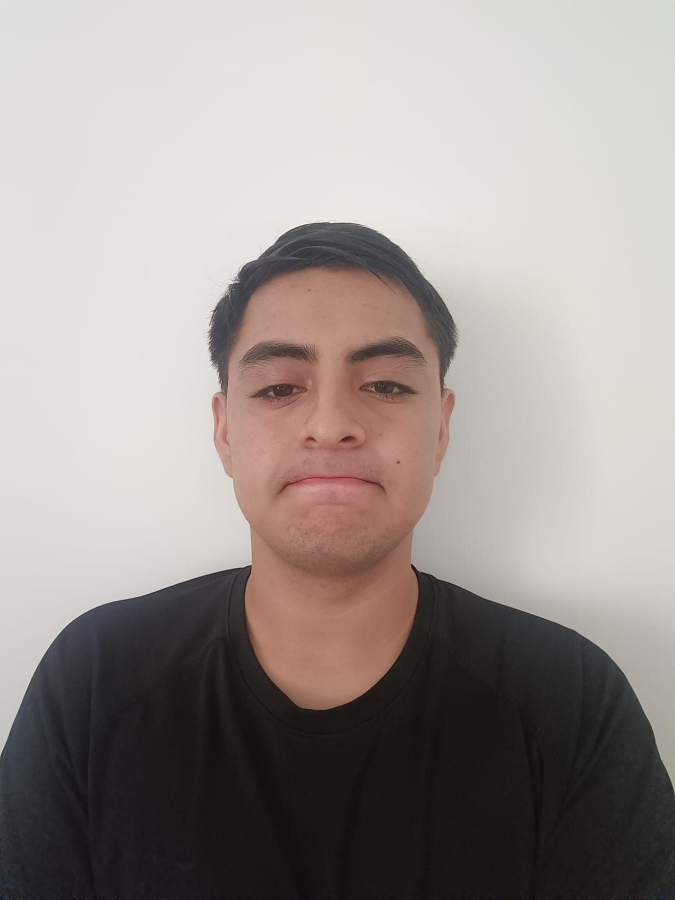
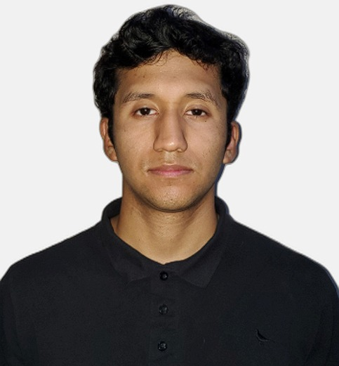

# Capítulo I: Introducción

En esta sección describimos el perfil de nuestra Startup.

## 1.1. Startup Profile

### 1.1.1. Descripción de la Startup

Pathly es una startup tecnológica fundada en 2024 por un equipo de estudiantes de Ingeniería de Software de la UPC, orientada a transformar el proceso de orientación vocacional de los jóvenes. Nuestra propuesta principal es una plataforma digital que combina herramientas automatizadas, como test vocacionales confiables, con la orientación personalizada de psicólogos vocacionales certificados.

Pathly nace con el objetivo de atender las necesidades detectadas en estudiantes de 4to y 5to de secundaria: la falta de claridad en la elección de carrera, la presión social y familiar, y la ausencia de un acompañamiento profesional estructurado. Asimismo, se identifica una oportunidad para integrar en el proceso a profesionales de la psicología que buscan nuevas formas de conectar con los adolescentes en su etapa de exploración vocacional.

Nuestra solución se posiciona en un mercado competitivo a través de un modelo dual —estudiantes y psicólogos—, diferenciándose por su enfoque humano, su facilidad de acceso digital, su validación profesional y su orientación continua basada en la experiencia del usuario (UX).

**Misión**  
Ofrecer una solución tecnológica integral que facilite la orientación vocacional de estudiantes de secundaria, combinando test automatizados, recomendaciones personalizadas y acompañamiento profesional certificado, para empoderarlos en la elección de su futuro académico y profesional.

**Visión**  
Convertirnos en la plataforma de referencia en orientación vocacional en Latinoamérica, reconocida por su enfoque humano, tecnológico e innovador, capaz de conectar a los jóvenes con sus verdaderas pasiones, talentos y proyectos de vida.

### 1.1.2. Perfiles de integrantes del equipo

| Foto | Descripción |
|------|------------|
|  | Estudio la carrera de Ingeniería de Software en la UPC. Me gusta el fútbol, surf, buceo y la tecnología. Soy una persona que siempre busca aprender nuevos conocimientos que me lleven a convertirme en un gran profesional y así poder cumplir mis metas cada día. |
|  | Mi nombre es Pedro Lecca y actualmente estudio la carrera de Ingeniería de Software en la Universidad UPC, sede San Miguel. Tengo 20 años y me considero una persona responsable, comprometida con el cumplimiento de mis deberes académicos. Además, valoro profundamente mantener una buena relación con mi equipo de trabajo, ya que estoy convencido de que un ambiente colaborativo y respetuoso permite alcanzar mejores resultados y potencia el desarrollo colectivo. |
|  | Mi nombre es Moisés Espinoza Chávez, estoy estudiando la carrera de Ingeniería de Software y actualmente me encuentro cursando el quinto ciclo. Me gusta el deporte y mantenerme en constante aprendizaje. Tengo conocimientos en SQL, C++ y un poco de HTML, CSS y JavaScript, así como habilidades para la adaptabilidad y la responsabilidad. |

## 1.2. Solution Profile

### 1.2.1. Antecedentes y Problemática

Aplicando la técnica 5W2H, se identifican las siguientes justificaciones:

- **Who (Quiénes):**  
  El problema afecta principalmente a estudiantes de 4to y 5to de secundaria, quienes atraviesan una etapa crítica de definición vocacional, así como a psicólogos vocacionales que buscan mejorar sus métodos de acompañamiento. Estos estudiantes, en su mayoría adolescentes de entre 15 y 18 años, enfrentan presiones externas de familiares, colegios y la sociedad para definir su futuro profesional en un corto plazo. Por su parte, los psicólogos tienen limitaciones de tiempo, herramientas y plataformas que dificultan una orientación efectiva, perdiendo oportunidades de seguimiento y personalización.

- **What (Qué):**  
  Existe una necesidad urgente de un proceso de orientación vocacional que sea estructurado, personalizado y tecnológicamente accesible. Actualmente, la mayoría de los estudiantes solo tiene acceso a test vocacionales genéricos, poco adaptados a su realidad personal, y que carecen de un verdadero acompañamiento posterior. Además, se observa que las decisiones de carrera se toman con información incompleta o bajo presión social, sin explorar a fondo intereses, habilidades y vocaciones reales. Esto puede derivar en deserción universitaria, frustración profesional y pérdida de años académicos valiosos.

- **Where (Dónde):**  
  La problemática se presenta en todo el territorio peruano, pero es especialmente visible en zonas urbanas y semiurbanas donde, a pesar de contar con acceso a internet y dispositivos digitales, las instituciones educativas no disponen de programas integrales de orientación vocacional. Muchos colegios carecen de especialistas dedicados exclusivamente a este proceso, delegándolo en psicólogos escolares generalistas que también deben atender temas conductuales, familiares y emocionales, reduciendo el tiempo y la calidad de la orientación vocacional.

- **When (Cuándo):**  
  El momento más crítico en el que se manifiesta esta necesidad es durante el cuarto y quinto año de secundaria. Es en esta etapa donde los estudiantes empiezan a considerar seriamente sus opciones de estudios superiores y de carrera, influenciados por ferias educativas, admisiones universitarias y expectativas familiares. Sin embargo, muchos enfrentan estos momentos cruciales sin contar con un autoconocimiento profundo, herramientas de decisión, o asesoría vocacional especializada, lo que aumenta la probabilidad de tomar decisiones apresuradas o erróneas.

- **Why (Por qué):**  
  El problema persiste porque los procesos de orientación vocacional en el país son fragmentados, insuficientes y en muchos casos inexistentes. Predomina el uso de métodos tradicionales poco actualizados, como test impresos obsoletos, sin adaptaciones a la realidad cambiante de nuevas carreras o tendencias profesionales emergentes. Además, la falta de articulación entre estudiantes, familias y orientadores genera un vacío de acompañamiento emocional y profesional. La ausencia de plataformas que combinen asesoría personalizada y tecnología accesible deja a los jóvenes sin un soporte integral para su desarrollo vocacional.

- **How (Cómo):**  
  La solución planteada es el desarrollo de una plataforma digital que combine:
  - Test vocacionales modernos, interactivos y adaptables a nuevos perfiles profesionales.
  - Un sistema de conexión directa con psicólogos certificados especializados en orientación vocacional.
  - Espacios de seguimiento y retroalimentación continua para evaluar el avance del estudiante en su autoconocimiento.
  - Recursos educativos complementarios, como videos, talleres virtuales y foros de exploración vocacional.
  La plataforma será de fácil acceso tanto desde web como dispositivos móviles, garantizando una experiencia amigable, intuitiva y segura para los adolescentes.

- **How much (Cuánto):**  
  Se propone un modelo de negocio freemium, en el cual los estudiantes puedan acceder gratuitamente a las funcionalidades básicas como el test inicial y contenidos educativos, y optar por planes de pago accesibles para sesiones personalizadas o asesorías avanzadas. Este modelo garantiza la inclusión de un mayor número de usuarios, permitiendo también que colegios puedan adoptar el servicio mediante convenios institucionales para sus estudiantes, democratizando el acceso a una orientación vocacional de calidad.

### 1.2.2. Lean UX Process

#### 1.2.2.1. Lean UX Problem Statements

En el Perú, miles de estudiantes de secundaria se enfrentan cada año a la difícil tarea de decidir qué carrera profesional seguir, en un contexto cargado de presión social, expectativas familiares y desinformación. A pesar de que la orientación vocacional debería ser un proceso acompañado, introspectivo y guiado por especialistas, la realidad educativa nacional muestra que este acompañamiento es escaso, superficial o totalmente ausente.

Muchos colegios carecen de programas integrales de orientación vocacional y solo ofrecen sesiones breves o test genéricos que no reflejan la realidad, intereses o fortalezas de cada estudiante. Esto deja a los adolescentes en un estado de incertidumbre que puede llevarlos a elegir carreras por descarte, imitación o presión externa, sin una comprensión real de sí mismos.

Por otro lado, los psicólogos vocacionales enfrentan barreras importantes: falta de tiempo, exceso de demanda, herramientas poco adaptadas a la era digital y escasa continuidad con cada estudiante. Esto limita su capacidad de brindar un proceso profundo y sostenido de orientación. La tecnología, que podría ser una aliada en este contexto, aún no se integra de manera eficaz y humanizada al proceso vocacional escolar.

Pathly nace con el propósito de transformar esta realidad. Nuestra propuesta busca ofrecer una solución digital accesible, que integre evaluaciones vocacionales modernas con asesoría personalizada, permitiendo a los estudiantes conocerse mejor y tomar decisiones informadas, y a los psicólogos gestionar eficientemente cada caso.

Lo que nos diferencia es el enfoque dual y colaborativo: unir a estudiantes y profesionales en una misma plataforma que respete el ritmo del usuario, facilite el seguimiento, y garantice la calidad del acompañamiento vocacional mediante validación profesional y buenas prácticas de UX.

Los hallazgos de nuestras entrevistas evidencian que tanto estudiantes como orientadores desean una experiencia más fluida, empática, estructurada y continua, que combine lo mejor de la tecnología con el valor del contacto humano.

**¿Cómo podemos diseñar una plataforma que no solo facilite la toma de decisiones vocacionales, sino que también promueva un proceso empático, guiado, accesible y sostenido en el tiempo para estudiantes y psicólogos?**

### 1.2.2.2. Lean UX Assumptions

A partir de la problemática detectada y el análisis de usuarios, se establecen las siguientes suposiciones clave que guían el desarrollo inicial de Pathly:

**Suposiciones sobre estudiantes de secundaria:**

- Suponemos que los estudiantes de 4to y 5to de secundaria **no tienen claro qué carrera elegir** y necesitan herramientas confiables para conocerse mejor.
- Suponemos que **valoran la opinión de sus padres y profesores**, pero buscan decidir por sí mismos con mayor seguridad.
- Suponemos que muchos **han realizado test vocacionales genéricos** en internet, pero no confían del todo en sus resultados.
- Suponemos que **prefieren plataformas visuales, intuitivas y móviles**, debido a su afinidad con la tecnología y el uso cotidiano de redes sociales.
- Suponemos que los estudiantes se sienten más cómodos **si pueden acceder a orientación desde casa o fuera del horario escolar**.

**Suposiciones sobre psicólogos vocacionales:**

- Suponemos que los psicólogos escolares y vocacionales **desean llegar a más estudiantes** sin sacrificar la calidad del proceso.
- Suponemos que necesitan **herramientas digitales que integren test, historial y seguimiento** de los casos en una misma plataforma.
- Suponemos que **valoran mantener el contacto humano**, pero estarían dispuestos a usar una plataforma si mejora la gestión y organización de su trabajo.
- Suponemos que **prefieren trabajar en entornos donde puedan validar su experiencia profesional**, generar reputación y recibir retroalimentación.

**Suposiciones sobre el entorno digital:**

- Suponemos que una plataforma digital debe ofrecer **resultados de test personalizables**, acompañados de recomendaciones prácticas y claras.
- Suponemos que la solución debe incluir **funciones de contacto directo entre estudiante y orientador** (como chat o videollamada).
- Suponemos que un modelo freemium permitiría **captar usuarios sin barreras económicas**, y que un sistema de perfiles motivaría el uso frecuente.

---

**User Outcomes:**

- Que los estudiantes descubran con mayor claridad sus intereses, habilidades y opciones de carrera.
- Que tomen decisiones vocacionales con mayor seguridad y menor presión externa.
- Que puedan acceder a orientación personalizada sin importar limitaciones geográficas o económicas.
- Que los psicólogos logren mejorar su capacidad de seguimiento, organización y calidad en el proceso de orientación.

---

**Business Outcomes:**

- Lograr una alta adopción inicial entre estudiantes de secundaria y psicólogos vocacionales.
- Generar alianzas con instituciones educativas para implementar Pathly como herramienta oficial de orientación.
- Incrementar la conversión de usuarios gratuitos a planes de pago mediante valor percibido.
- Construir una red profesional sólida que refuerce la confianza y reputación de la plataforma.
