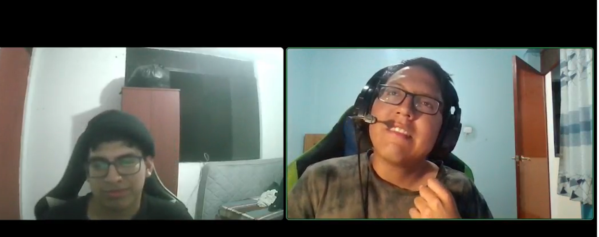
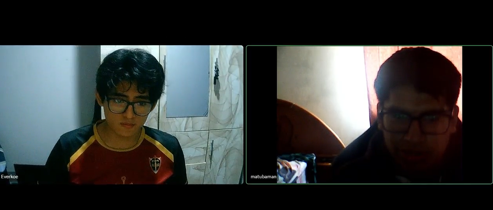
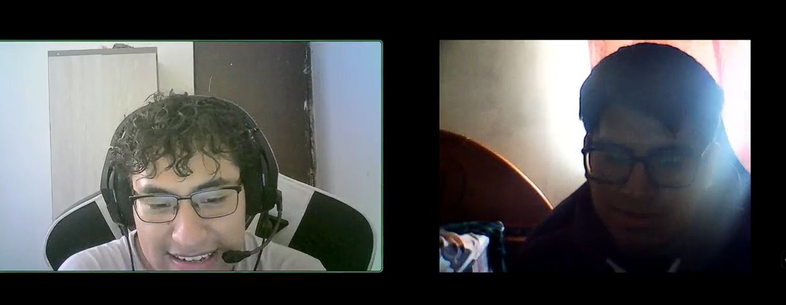
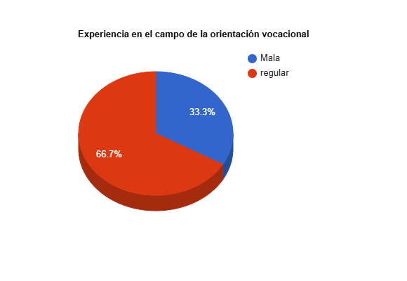
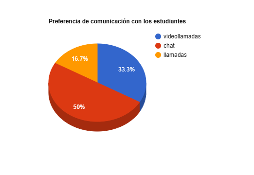
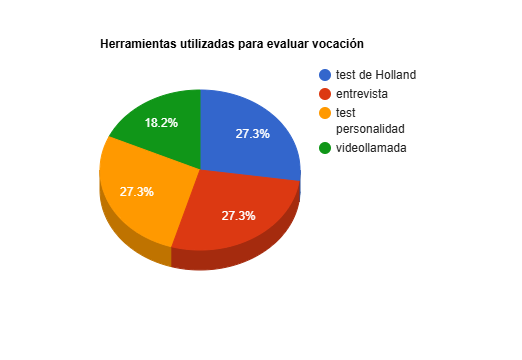
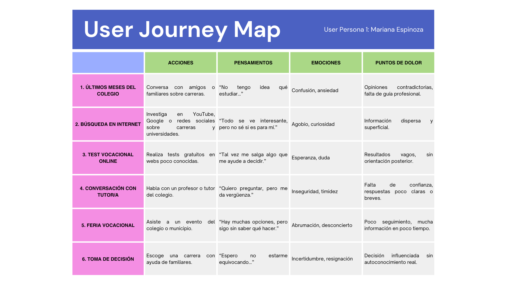
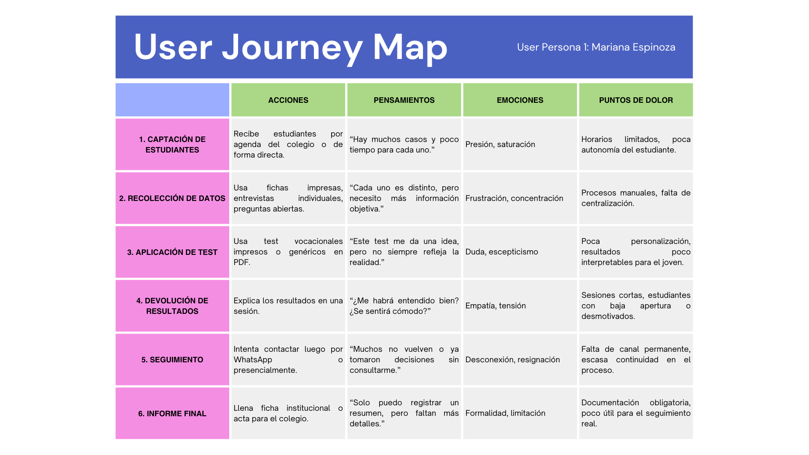
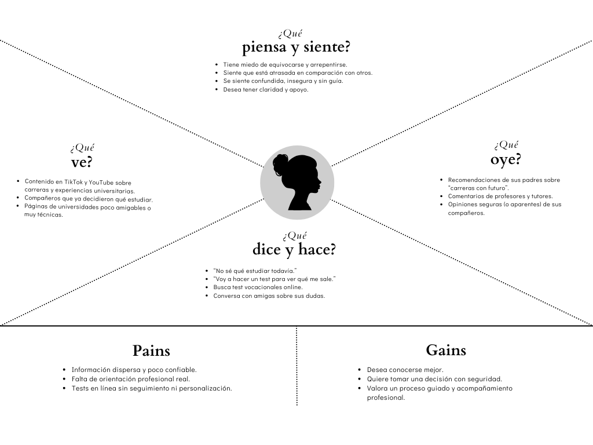
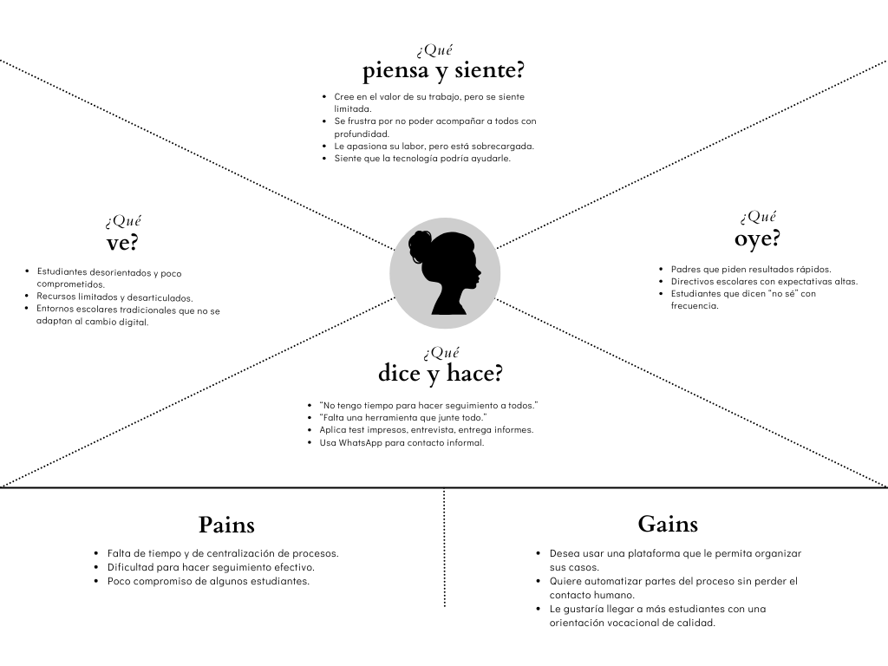

# Capítulo II: Requirements Elicitation & Analysis

## 2.1. Competidores

### 2.1.1. Análisis competitivo

#### ¿Por qué llevar a cabo este análisis?

Este análisis busca comprender el posicionamiento de **Pathly** en comparación con otras plataformas que ofrecen servicios relacionados a la orientación vocacional y el acompañamiento psicológico, identificando oportunidades de mejora y diferenciación frente a las necesidades de nuestros segmentos objetivos: estudiantes de secundaria (4to y 5to año) y profesionales certificados en psicología y consejería vocacional.

---

### Competitive Analysis Landscape

| **Categoría** | **Pathly** | **Psyalive** | **Orienta.me** | **Oriéntate** |
|--------------|------------|--------------|----------------|----------------|
| **Perfil** |||||
| **Overview** | Plataforma digital que ofrece orientación vocacional a estudiantes mediante test vocacionales, recomendaciones personalizadas y acompañamiento profesional. | Plataforma de psicología online que conecta pacientes con psicólogos licenciados. | Plataforma de asistencia integral (PAE) con enfoque en bienestar emocional, legal y médico. | Web especializada en orientación vocacional a través de tests interactivos y recursos educativos. |
| **Ventaja competitiva / Valor** | Enfoque dual: atención a estudiantes y trabajo conjunto con psicólogos certificados; integra evaluación automatizada con orientación personalizada. | Atención psicológica personalizada y confidencial en múltiples horarios. | Atención integral 24/7 para usuarios corporativos afiliados. | Foco 100% en vocación con tests y recursos didácticos para jóvenes. |
| **Perfil de Marketing** |||||
| **Mercado objetivo** | Estudiantes de 4to y 5to de secundaria, y psicólogos vocacionales certificados interesados en conectar con jóvenes. | Adultos y jóvenes con necesidades psicológicas, en general. | Empleados de empresas afiliadas a servicios de PAE. | Estudiantes de secundaria que buscan orientación vocacional en línea. |
| **Estrategias de marketing** | Alianzas con colegios, redes sociales dirigidas a escolares y posicionamiento como herramienta profesional para psicólogos. | SEO, pauta en redes, testimonios de usuarios. | Convenios corporativos y promoción interna. | Posicionamiento en buscadores y portales educativos. |
| **Perfil de Producto** |||||
| **Productos & Servicios** | Tests vocacionales + guía profesional en línea + recomendaciones personalizadas + red de psicólogos. | Terapia psicológica por videollamada o chat. | Orientación emocional, legal, médica y vocacional (limitada). | Tests vocacionales, recursos educativos y orientación automática. |
| **Precios & Costos** | Freemium: acceso gratuito al test, pagos por sesiones y paquetes con profesionales. | Tarifa por sesión (entre $20–$50 aprox.). | Costo cubierto por empresa afiliada. | Mayoritariamente gratuito con opciones premium. |
| **Canales de distribución (Web/Móvil)** | Web responsive y futura app móvil. | Web y app móvil. | Web y app móvil. | Solo Web. |

---

### Análisis SWOT

| **SWOT**        | **Pathly** | **Psyalive** | **Orienta.me** | **Oriéntate** |
|----------------|------------|--------------|----------------|----------------|
| **Fortalezas** | Modelo dual: estudiantes + red de psicólogos; enfoque vocacional claro; diseño UX. | Psicólogos licenciados; alta disponibilidad. | Cobertura 24/7; servicios integrales. | Interfaz sencilla y enfoque claro en vocación. |
| **Debilidades** | Startup nueva, sin reputación consolidada. | No ofrece orientación vocacional. | No enfocado en estudiantes ni orientación educativa. | Sin acompañamiento profesional. |
| **Oportunidades** | Trabajar con colegios y profesionales independientes. | Ampliar vertical educativa. | Expandirse a población estudiantil. | Incluir red de psicólogos. |
| **Amenazas** | Mayor experiencia y recursos de la competencia. | Pérdida de cuota frente a plataformas educativas. | Cambios en necesidades de los jóvenes. | Avance de soluciones híbridas más completas. |

## 2.1.2. Estrategias y tácticas frente a competidores

En base al análisis competitivo, se han definido estrategias que permitirán a **Pathly** posicionarse efectivamente frente a otras plataformas, atendiendo tanto a estudiantes de secundaria como a psicólogos vocacionales certificados.

### Estrategias

- **Modelo colaborativo estudiante-profesional**: Ofrecer una experiencia integrada donde los psicólogos certificados puedan atender directamente a los estudiantes luego del test vocacional.

- **Especialización en segmento escolar**: Construir Pathly como la plataforma de referencia para estudiantes de secundaria que requieren apoyo en su decisión vocacional.

- **Facilidad de acceso digital**: Mantener una interfaz amigable, accesible desde dispositivos móviles, sin barreras técnicas o económicas para el estudiante.

- **Red profesional de confianza**: Filtrar y certificar a los psicólogos que participan en la plataforma, brindando seguridad y respaldo institucional.

### Tácticas

- **Plataforma freemium dirigida a estudiantes**: Test gratuito con acceso opcional a orientación profesional pagada. Esto permite captar usuarios y monetizar progresivamente.

- **Campañas educativas y testimonios reales**: Promover la orientación vocacional en redes sociales mediante historias de estudiantes y psicólogos.

- **Alianzas con instituciones educativas**: Establecer convenios con colegios para ofrecer Pathly como recurso oficial.

- **Panel para profesionales**: Crear una interfaz especial para psicólogos certificados donde puedan gestionar citas, dar seguimiento y comunicarse con estudiantes.

- **Mejoras iterativas basadas en entrevistas**: Validar la plataforma en campo con ambos segmentos objetivo y adaptar funciones según sus necesidades reales.

## 2.2. Entrevistas

### 2.2.1. Diseño de entrevistas

Para diseñar entrevistas efectivas se han definido dos bloques de preguntas diferenciadas por segmento, aplicando buenas prácticas como: preguntas abiertas, lenguaje claro, tono amigable y estructura flexible.

El objetivo principal es obtener información clave para construir arquetipos sólidos, considerando variables demográficas, psicológicas y de comportamiento digital, además de motivaciones, frustraciones y necesidades.

### Segmento 1: Estudiantes de 4to y 5to de secundaria

#### Objetivo
Comprender su contexto académico, intereses, uso de tecnología, nivel de conocimiento sobre orientación vocacional y sus expectativas frente a una posible plataforma digital como Pathly.

#### Preguntas principales
1. ¿En qué grado estás y en qué colegio estudias?
2. ¿Qué tanto conoces sobre orientación vocacional?
3. ¿Has hecho antes algún test vocacional? ¿Cómo fue tu experiencia?
4. ¿Qué esperas encontrar en una plataforma que te ayude a elegir tu carrera?
5. ¿Cómo tomas decisiones importantes como elegir una carrera?
6. ¿Conversas con tus padres, profesores o psicólogos sobre tu futuro profesional?
7. ¿Qué tipo de contenido te gusta ver en internet y en qué plataformas pasas más tiempo?
8. ¿Prefieres usar una app o una página web cuando necesitas buscar algo útil?

#### Preguntas complementarias
- ¿Qué materias o actividades disfrutas más en el colegio?
- ¿Qué carrera(s) te interesan y por qué?
- ¿Qué cosas te frustran cuando piensas en tu futuro?
- ¿Has sentido presión por decidir tu carrera demasiado pronto?
- ¿Qué tan fácil sería para ti acceder a una videollamada con un psicólogo?

---

### Segmento 2: Psicólogos y consejeros vocacionales certificados

#### Objetivo
Conocer su experiencia en orientación vocacional, métodos de trabajo actuales, disposición a usar plataformas digitales, y sus necesidades para trabajar con adolescentes.

#### Preguntas principales
1. ¿Qué experiencia tienes en el campo de la orientación vocacional?
2. ¿Trabajas actualmente con estudiantes escolares? ¿Cómo suelen llegar a ti?
3. ¿Qué herramientas usas para evaluar vocación y tomar decisiones con los estudiantes?
4. ¿Qué opinas del uso de test vocacionales automatizados?
5. ¿Qué elementos consideras clave en una buena orientación vocacional?
6. ¿Estarías dispuesto a brindar servicios a través de una plataforma como Pathly?
7. ¿Qué características debería tener una plataforma para facilitar tu trabajo?
8. ¿Qué problemas enfrentas al trabajar con adolescentes en orientación vocacional?

#### Preguntas complementarias
- ¿Tienes experiencia con plataformas digitales o teleorientación?
- ¿Qué tipo de comunicación prefieres con los estudiantes (videollamada, chat, correo)?
- ¿Qué tipo de seguimiento realizas después de la orientación?
- ¿Te gustaría acceder a un panel de gestión de usuarios?
- ¿Qué tan dispuesto estás a trabajar en un sistema con validación y reputación profesional?

### 2.2.2. Registro de entrevistas
 ***Segmento 1:Jóvenes estudiantes de 15 - 19 años***
  **Entrevista N°1: Adrian Valera**
  - Sexo: Masculino
  - Edad: 17 años
  - Ubicación en la que vive olivos, Lima, Perú
    
    

**Entrevista**:
- link: https://drive.google.com/file/d/1ytI4TQHYi9yd6shk1knVcFKFqv8wHry7/view?usp=drive_link
- Momento en el que inicia: 0:02
- Duración: 7:07

**Resumen:**

Adrian Valera es un chico de 5to grado de secundaria que aun no ha escogido una carrera ya que tiene el temor de que sea una opcion incorrecta  a las preguntas propuestas que ha tenido  muy poco acercamiento a los test vocacionales onlinne pero si ha llevado en lugares con psicologos y no ha sido de su agrado ya que a el le gustaria ver un poco mas de informacion y que el psicologo siga su orientacion paso por paso para que pueda escoger una carrera de acuerdo a su test vocacional ,con la pregunta de servicios a traves de una plataforma el se sintio muy agusto que tuviera esa facilidad para poder interactuar con test vocacional y un psicologo que 
lo ayude en ese proceso y que le gustaria estudiar psicologia. 

  **Entrevista N°2: Anyelo Alejos**
  - Sexo: Masculino
  - Edad: 17 años
  - Ubicación en la que vive Independencia, Lima, Perú

    
**Entrevista**:
- link: https://upcedupe-my.sharepoint.com/:v:/g/personal/u202314304_upc_edu_pe/EZ3MnphrLQ5DrRb7NmGPEZEBDl3JarEgirlFJFtvqdAkZw?e=YOkBkE&nav=eyJyZWZlcnJhbEluZm8iOnsicmVmZXJyYWxBcHAiOiJTdHJlYW1XZWJBcHAiLCJyZWZlcnJhbFZpZXciOiJTaGFyZURpYWxvZy1MaW5rIiwicmVmZXJyYWxBcHBQbGF0Zm9ybSI6IldlYiIsInJlZmVycmFsTW9kZSI6InZpZXcifSwicGxheWJhY2tPcHRpb25zIjp7InN0YXJ0VGltZUluU2Vjb25kcyI6Mi4yNn19
- Momento en el que inicia: 0:02
- Duración: 5:55

**Resumen:**
Anyelo Alejos, estudiante de quinto de secundaria, se encuentra en proceso de exploración vocacional y aún no ha decidido una carrera específica. No ha realizado un test vocacional formal, pero muestra interés en herramientas que le permitan conocerse mejor y tomar decisiones informadas. Se describe como reflexivo, con una actitud madura frente a su futuro, y suele apoyarse en sus padres y profesores para discutir temas relacionados a su orientación profesional. Reconoce sentir cierta presión por definir su futuro pronto, y valora mucho el acompañamiento que una plataforma podría ofrecerle para aclarar sus dudas.

En cuanto a su vida digital, Angelo utiliza principalmente su smartphone y en menor medida una laptop. Pasa tiempo en YouTube y TikTok, consumiendo tanto contenido educativo como de entretenimiento. Prefiere las apps móviles por su practicidad, aunque también está cómodo usando páginas web, siempre que sean intuitivas. Navega con Google Chrome y está familiarizado con redes sociales como Instagram. Considera que una plataforma vocacional efectiva debe ofrecer tests, información clara, y espacios de interacción con orientadores, ya que las sesiones presenciales a veces no le son accesibles por tiempo o disponibilidad.

***Segmento 2:Psicólogos enfocados en orientación vocacional***

**Entrevista N°1: Maricielo Rugel**
- Sexo: Femenino
- Edad: 23 años
- Ubicación en la que vive olivos, Lima, Perú
  **Entrevista:**
  link:https://upcedupe-my.sharepoint.com/:v:/g/personal/u202314304_upc_edu_pe/EcVMA4GvuX5PiYD6y-ZQDQoBMpOEFHInTl34d-NKVHWzAA?e=Xkc9TW
- Momento en el que inicia: 0:00
- Duración: 7:49
  
**Resumen:**
Maricielo es licenciada en Psicología y cuenta con experiencia trabajando en el área de orientación vocacional para estudiantes. Actualmente, se desempeña en el sector de Recursos Humanos, pero conserva un fuerte interés por los procesos de acompañamiento a jóvenes que están en búsqueda de su vocación.
Durante nuestra conversación, Maricielo nos compartió información valiosa sobre cómo se orienta a los estudiantes que aún no han iniciado un proceso vocacional o que no están familiarizados con los test vocacionales. Nos explicó detalladamente el paso a paso que debería seguir un estudiante para realizar un test vocacional de manera adecuada, desde la preparación previa hasta la interpretación de resultados con apoyo profesional.
Además, resaltó que una plataforma vocacional debería contar con un sistema de comunicación rápido y eficaz entre el estudiante y el orientador, para garantizar una mejor conexión y acompañamiento personalizado. También hizo énfasis en que, para generar confianza en el producto, sería fundamental implementar un sistema de filtrado o validación de profesionales, que asegure que quienes orientan a los estudiantes cuenten con la preparación y experiencia necesarias.
Su perspectiva refuerza la importancia de unir la tecnología con un enfoque humano y profesional para ofrecer una experiencia vocacional confiable, útil y accesible.

**Entrevista N°2:  Antonella Rugel**
- Sexo: Femenino
- Edad: 28 años
- Ubicación en la que vive olivos, Lima, Perú

 **Entrevista:**

link:https://upcedupe-my.sharepoint.com/:v:/g/personal/u202314304_upc_edu_pe/EfgU6lkVBSdAu4djjhTMSGABFNyjN-QAbxvux7EK8lC03w?e=HzHUxX&nav=eyJyZWZlcnJhbEluZm8iOnsicmVmZXJyYWxBcHAiOiJTdHJlYW1XZWJBcHAiLCJyZWZlcnJhbFZpZXciOiJTaGFyZURpYWxvZy1MaW5rIiwicmVmZXJyYWxBcHBQbGF0Zm9ybSI6IldlYiIsInJlZmVycmFsTW9kZSI6InZpZXcifX0%3D
- Momento en el que inicia: 0:00
-Duración: 7:49

**Resumen:**
Antonella Rugel es licenciada en Psicología y actualmente se desempeña en el área de salud psicológica. Cuenta con más de tres años de experiencia brindando orientación a jóvenes en la búsqueda de su vocación, utilizando herramientas como los test de Holland y Kuder.
Sin embargo, Antonella nos comentó que, a pesar de ser herramientas útiles, estos test presentan una limitación importante: no incluyen todas las carreras que existen actualmente, lo que puede restringir las opciones para los estudiantes y limitar su visión sobre el amplio abanico de posibilidades profesionales.
Durante su experiencia, ha observado que las carreras que los jóvenes suelen descartar con mayor frecuencia son las relacionadas con humanidades, así como algunas otras que, en muchos casos, no cuentan con la aprobación o respaldo de sus padres. En contraste, las carreras que suelen tener más interés y demanda son aquellas vinculadas a las ingenierías, la medicina y la arquitectura, debido a su prestigio social y las expectativas familiares.
Antonella también resaltó la importancia del rol que cumplen los padres en este proceso, ya que, en varias situaciones, no solo se orienta al estudiante, sino que también se trabaja con la familia para que exista un entendimiento y acompañamiento adecuado.En algunos casos la desinformación de los jóvenes puede ser muy preocupante para los psicólogos al evaluarlos.

  **Entrevista N°3: Marcos Contreras**
  - Sexo: Masculino
  - Edad: 24 años
  - Ubicación en la que vive Independencia, Lima, Perú
    
    

**Entrevista**:
- link: https://upcedupe-my.sharepoint.com/:v:/g/personal/u202314304_upc_edu_pe/Eb72kDMH6gNHt9tAQhgZkZYBXCf9tGGwbrpUYmwE7SYbDA?e=wrH5Qu&nav=eyJyZWZlcnJhbEluZm8iOnsicmVmZXJyYWxBcHAiOiJTdHJlYW1XZWJBcHAiLCJyZWZlcnJhbFZpZXciOiJTaGFyZURpYWxvZy1MaW5rIiwicmVmZXJyYWxBcHBQbGF0Zm9ybSI6IldlYiIsInJlZmVycmFsTW9kZSI6InZpZXcifSwicGxheWJhY2tPcHRpb25zIjp7InN0YXJ0VGltZUluU2Vjb25kcyI6MS45Nn19
  
- Momento en el que inicia: 0:02
- Duración: 4:24

**Resumen:**
Marcos Contreras es egresado de la carrera de Psicología y actualmente trabaja en el área de orientación vocacional, especialmente con estudiantes escolares. Durante la entrevista, mencionó que suele atender a los alumnos tanto de manera presencial como virtual, y que muchos llegan a él por recomendación institucional o familiar. Utiliza diversas herramientas para evaluar la vocación, como entrevistas, test psicométricos y dinámicas de autoconocimiento. Está abierto al uso de plataformas digitales automatizadas siempre que estas sirvan de apoyo y no reemplacen la interacción humana esencial en estos procesos. Mostró disposición a ofrecer sus servicios a través de una plataforma como PG, especialmente si cuenta con funciones que faciliten la gestión y seguimiento de estudiantes.

Sobre los desafíos que enfrenta, comentó que muchos adolescentes sienten incomodidad al expresarse o no toman con seriedad los procesos vocacionales, lo que dificulta una orientación efectiva. Considera clave que una plataforma incluya recursos visuales, interacción personalizada, y un panel de gestión donde pueda dar seguimiento a cada estudiante. Tiene experiencia con herramientas digitales y prefiere comunicarse con los alumnos por videollamada o chat, ya que le permite una relación más cercana. Además, mencionó que realiza seguimientos posteriores a las sesiones, y que le sería muy útil una plataforma que le permita organizar su base de usuarios y gestionar sus casos en un solo lugar.

### 2.2.3. Análisis de entrevistas

 ***Segmento 1:Jóvenes estudiantes de 15 - 19 años***
  **Entrevista 1**:
  Adrián nos comentó que le gustaría contar con una plataforma de orientación vocacional, siempre y cuando esta cuente con certificaciones oficiales y ofrezca una guía personalizada durante todo el proceso. Además, señaló que los test vocacionales en formato físico que ha realizado anteriormente no le han resultado útiles ni satisfactorios, por lo que considera que una plataforma bien estructurada y acompañada por profesionales podría brindarle mayor confianza y mejores resultados.
  **Entrevista 2**:
Angelo es un joven que busca herramientas digitales accesibles, interactivas y con un toque personal para guiarlo en su exploración vocacional, por lo que una plataforma que combine tecnología con interacción humana sería una solución ideal para su caso.
**Entrevista 3**:

***Segmento 2:Psicólogos enfocados en orientación vocacional***
**Entrevista N°1:**
Maricielo ofrece una perspectiva valiosa que resalta la importancia de una orientación vocacional estructurada y profesional, en la que los estudiantes reciban un acompañamiento cercano y personalizado. Coincide con otros entrevistados en la necesidad de contar con canales de comunicación eficientes y un seguimiento adecuado, además de la relevancia de un sistema de validación de profesionales que garantice la calidad del servicio.

**Entrevista N°2:**
Antonella nos comento que quisiera una plataforma digital que combine herramientas de orientación vocacional actualizadas, seguimiento personalizado y la posibilidad de involucrar a las familias podría ser una solución integral que potencie el trabajo de psicólogos como Antonella y Marcos. Esto permitiría que los jóvenes tengan acceso a información relevante, interactúen con expertos de manera accesible y, lo más importante, reciban un apoyo adecuado tanto de los profesionales como de sus familias.
**Entrevista N°3:**
Marcos es un profesional con un enfoque integrador y abierto a la innovación tecnológica, siempre que estas herramientas respeten la importancia de la interacción personal y ayuden a mejorar la experiencia de orientación vocacional de los estudiantes.

## 2.3. Needfinding

### 2.3.1. User Personas

Esta sección presenta dos arquetipos desarrollados para representar a los segmentos objetivos de Pathly: estudiantes de secundaria y profesionales de la orientación vocacional.

### User Persona: Estudiante de secundaria

**Nombre**: Mariana Espinoza  
**Edad**: 16 años  
**Género**: Femenino  
**Grado**: 5to de secundaria  
**Ubicación**: Villa El Salvador, Lima  
**Tipo de institución**: Colegio nacional  
**Acceso digital**: Celular propio con acceso a datos móviles y Wi-Fi en casa  

**Objetivos**:
- Descubrir qué carrera se adapta mejor a sus gustos e intereses.
- Entender qué pasos debe seguir después del colegio.

**Frustraciones**:
- Siente presión familiar para decidir su futuro sin orientación clara.
- Le cuesta identificar sus habilidades fuertes.
- Le confunde la cantidad de información que encuentra en internet.

**Habilidades y fortalezas**:
- Buen desempeño en cursos de comunicación y arte.
- Actitud reflexiva y empática.
- Curiosa, usuaria activa de redes sociales.

**Canales digitales preferidos**:
- TikTok, Instagram, YouTube  
- Prefiere contenido audiovisual e interactivo.
  
---

### User Persona: Psicóloga vocacional

**Nombre**: Carla Huamán  
**Edad**: 35 años  
**Profesión**: Psicóloga con especialización en orientación vocacional  
**Ubicación**: Arequipa, Perú  
**Experiencia**: 10 años trabajando con escolares en colegios privados y de convenio  
**Canales de atención actuales**: Sesiones presenciales y ocasionalmente por Zoom  
**Acceso digital**: Laptop y celular con buena conectividad  

**Objetivos**:
- Llegar a más estudiantes con orientación de calidad.
- Utilizar herramientas digitales que faciliten su trabajo.
- Establecer un canal confiable donde pueda organizar citas y hacer seguimiento.

**Frustraciones**:
- Limitaciones de tiempo para cada alumno en colegios.
- Falta de herramientas unificadas para evaluación vocacional.
- Resistencia de algunos padres al uso de plataformas digitales.

**Habilidades y fortalezas**:
- Alta empatía y experiencia guiando adolescentes.
- Capacidad para adaptar el lenguaje y generar confianza.
- Manejo fluido de recursos digitales educativos.

**Canales digitales preferidos**:
- Zoom, WhatsApp, Google Forms  
- Le interesan plataformas con agenda integrada y ficha por estudiante.

### 2.3.2. User Task Matrix

Los segmentos considerados son:
- **Estudiante de secundaria (Mariana Espinoza)**
- **Psicóloga vocacional (Carla Huamán)**

### Matriz de tareas por User Persona

| **Tarea**                                                   | **Estudiante** Frecuencia | **Estudiante** Importancia | **Psicóloga** Frecuencia | **Psicóloga** Importancia |
|-------------------------------------------------------------|-------------------------------|-------------------------------|------------------------------|------------------------------|
| Buscar información sobre carreras o universidades           | Media                         | Alta                          | Baja                         | Media                        |
| Hablar con adultos sobre su futuro                          | Alta                          | Alta                          | Alta                         | Alta                         |
| Hacer test vocacionales gratuitos en internet               | Media                         | Media                         | Baja                         | Baja                         |
| Ver contenido vocacional o educativo en redes sociales      | Alta                          | Media                         | Media                        | Media                        |
| Asistir a charlas o ferias vocacionales                     | Baja                          | Alta                          | Alta                         | Alta                         |
| Realizar sesiones de orientación vocacional personalizadas  | Baja                          | Alta                          | Alta                         | Alta                         |
| Leer o responder mensajes sobre seguimiento vocacional      | Media                         | Alta                          | Alta                         | Alta                         |
| Coordinar horarios o sesiones con estudiantes               | N/A                           | N/A                           | Alta                         | Alta                         |
| Diseñar o aplicar herramientas vocacionales (tests, guías)  | N/A                           | N/A                           | Media                        | Alta                         |

---

### Análisis comparativo

- Las tareas con **mayor coincidencia en importancia** para ambos segmentos son:
  - Hablar sobre el futuro profesional.
  - Participar en sesiones de orientación vocacional.
  - Asistir a eventos vocacionales.

- Para los **estudiantes**, las tareas con más frecuencia son:
  - Uso de redes sociales como medio indirecto de exploración vocacional.
  - Conversaciones con adultos de confianza.

- Para los **psicólogos**, las tareas de mayor frecuencia e importancia se centran en:
  - Coordinar sesiones.
  - Aplicar herramientas vocacionales.
  - Hacer seguimiento continuo.

### 2.3.3. User Journey Mapping

Los siguientes recorridos representan la experiencia actual (*As-Is*) de los segmentos objetivo de Pathly en su proceso de orientación vocacional.

---

### Estudiante de secundaria (Mariana Espinoza)

  
---

### Psicóloga vocacional (Carla Huamán)

## 2.3.4. Empathy Mapping

### Estudiante de secundaria (Mariana Espinoza)

### Psicóloga vocacional (Carla Huamán)

### 2.3.5. As-Is Scenario Mapping

### Estudiante de secundaria – Mariana Espinoza

| **Phases**             | **Doing**                                                                 | **Thinking**                                           | **Feeling**                  |
|------------------------|---------------------------------------------------------------------------|--------------------------------------------------------|-------------------------------|
| Inicio de búsqueda     | Escucha a amigos, padres, profesores hablar de carreras.                  | “Todos parecen tener claro qué hacer, menos yo.”       | Ansiedad, presión social      |
| Exploración online     | Googlea “qué carrera estudiar”, mira videos en YouTube, hace un test.    | “Tal vez esto me dé una idea.”                         | Confusión, curiosidad         |
| Toma decisiones parciales| Descarta algunas opciones, conversa con familiares.                     | “No estoy segura, pero necesito avanzar con algo.”     | Inseguridad, dudas            |
| Participación en eventos| Asiste a charla o feria vocacional del colegio.                         | “Todo suena bien, pero no sé cómo saber si es para mí.”| Agobio, desorientación        |
| Elección final         | Escoge una carrera influenciada por entorno o intuición.                 | “Espero no arrepentirme.”                              | Incertidumbre, resignación    |

---

### Psicóloga vocacional – Carla Huamán

| **Phases**             | **Doing**                                                                 | **Thinking**                                              | **Feeling**               |
|------------------------|---------------------------------------------------------------------------|-----------------------------------------------------------|----------------------------|
| Recepción del caso     | Lee ficha del alumno, agenda sesión presencial.                          | “Tengo poco tiempo para conocerlo bien.”                  | Tensión, carga laboral     |
| Evaluación inicial     | Aplica test, entrevista, observa actitudes.                              | “Este test es básico, necesito más datos cualitativos.”   | Limitación, frustración    |
| Interpretación         | Analiza respuestas y comportamiento.                                     | “Hay muchas variables que no puedo cubrir en 30 min.”     | Incertidumbre, esfuerzo    |
| Devolución de resultados| Comunica hallazgos al estudiante, sugiere opciones.                    | “Espero que esto le sirva para reflexionar.”              | Empatía, duda              |
| Cierre o seguimiento   | Entrega informe, intenta seguimiento si es posible.                      | “Muchos alumnos no regresan o ya decidieron solos.”       | Desconexión, frustración   |

---

### Blank Areas

- **Para el estudiante**:
  - Falta de claridad sobre sus propias fortalezas.
  - Procesos de autoconocimiento dispersos y sin orientación profesional.
  - Acciones reactivas más que planificadas.

- **Para la psicóloga**:
  - Procesos fragmentados sin centralización de información.
  - Poco tiempo por estudiante.
  - Escasa continuidad en el acompañamiento.

## 2.4. Ubiquitous Language

Este glosario contiene los términos clave del dominio de negocio de Pathly, redactados sin ambigüedad y utilizados de forma consistente entre todos los miembros del equipo. Los términos están en inglés (con su equivalente en español entre paréntesis) y las definiciones se presentan en español. Este lenguaje común permite una comunicación clara y coherente en todo el proceso de diseño y desarrollo.

| **Term (Término)**                        | **Definition (Definición)**                                                                 |
|------------------------------------------|---------------------------------------------------------------------------------------------|
| Vocational Test (*Test vocacional*)      | Herramienta de evaluación estructurada que permite identificar carreras compatibles con los intereses, habilidades y rasgos de personalidad de un estudiante. |
| Student Journey (*Recorrido del estudiante*) | Secuencia de pasos, decisiones y emociones que atraviesa un estudiante durante su proceso de orientación vocacional. |
| Career Guidance (*Orientación vocacional*) | Proceso de acompañamiento para ayudar a los estudiantes a comprender sus opciones educativas y profesionales. |
| Counselor (*Consejero/a vocacional*)     | Profesional certificado que guía a los estudiantes en la toma de decisiones sobre su futuro profesional. |
| Self-awareness (*Autoconocimiento*)      | Capacidad del estudiante para reconocer sus propias fortalezas, intereses, valores y aspiraciones. |
| Frustration Point (*Punto de frustración*) | Momento en el que el estudiante o el profesional encuentra una barrera que dificulta el avance del proceso vocacional. |
| Student Segment (*Segmento de estudiantes*) | Grupo objetivo conformado por estudiantes de 4to y 5to de secundaria que buscan orientación vocacional. |
| Personalized Recommendation (*Recomendación personalizada*) | Sugerencia basada en el perfil individual del usuario que busca alinear sus características con posibles carreras. |
| Follow-up Session (*Sesión de seguimiento*) | Reunión posterior entre el consejero y el estudiante para evaluar avances, resolver dudas y continuar con la orientación. |
| Digital Touchpoint (*Punto de contacto digital*) | Instancia de interacción entre el usuario y la plataforma, como la toma de un test, entrega de resultados o agendamiento. |
