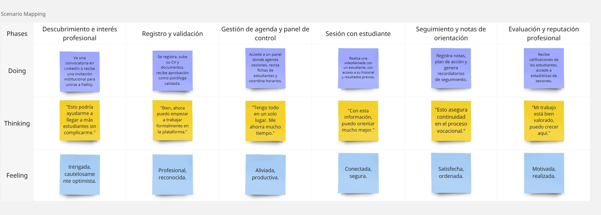

# Capítulo III: Requirements Specification

## 3.1. To-Be Scenario Mapping

**1. Estudiante de secundaria (Mariana Espinoza)**

Simular cómo sería una experiencia ideal con Pathly, desde la perspectiva del estudiante, comparándola con el As-Is ya trabajado. El flujo debe enfocarse en una experiencia estructurada, empática y guiada.

---

**2. Psicóloga vocacional (Carla Huamán)**

Diseñar la experiencia ideal de un psicólogo certificado utilizando Pathly, enfocándose en eficiencia, organización y vínculo con estudiantes.

## 3.2. User Stories

## 3.3. Impact Mapping

## 3.4. Product Backlog

