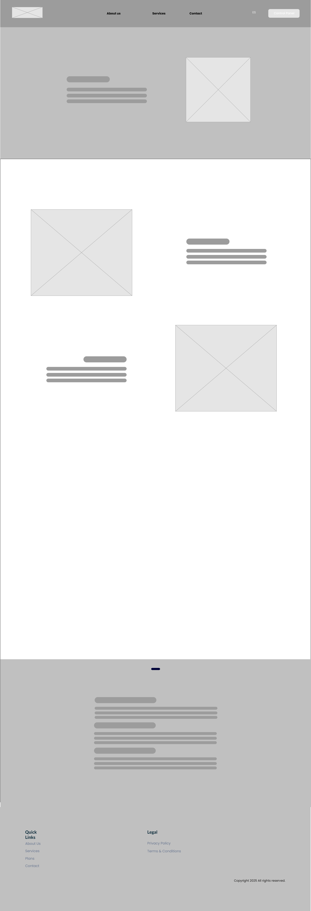
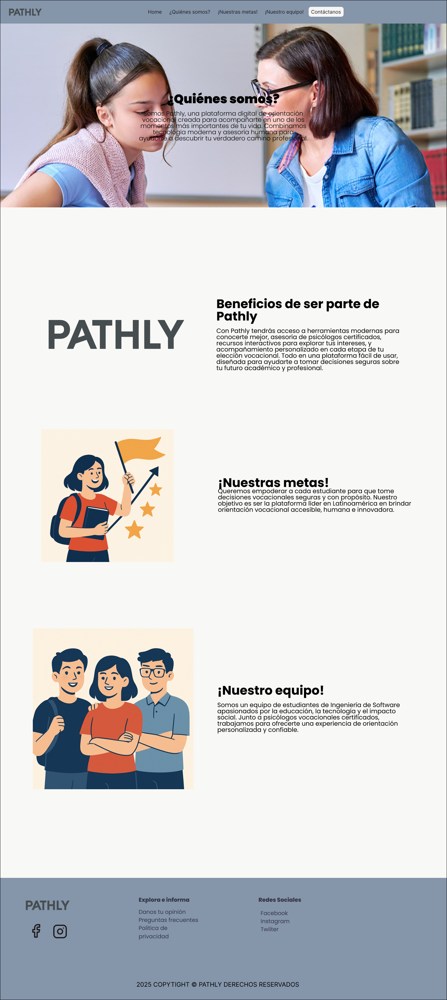
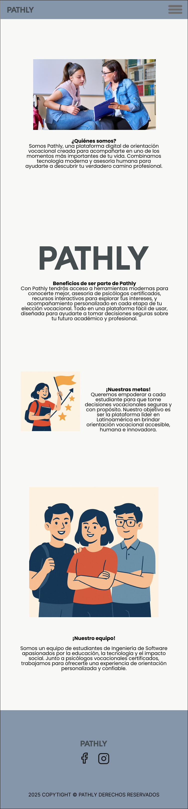

# Capítulo IV: Product Design
## 4.1. Style Guidelines
Las presentes guías de estilo definen la identidad visual y comunicacional de Pathly, nuestra plataforma digital de orientación vocacional. Su propósito es asegurar la coherencia en todos los elementos gráficos, tonos de comunicación y estructuras visuales que conforman tanto la aplicación web como la landing page.

### 4.1.1. General Style Guidelines

#### 4.1.1.1 Colores
La paleta de colores de Pathly ha sido cuidadosamente seleccionada para reflejar los valores de la marca: orientación, claridad, apoyo profesional y entusiasmo juvenil. Cada color cumple un rol visual y emocional específico dentro de la experiencia del usuario.

`#23383F`– **Dark Night**

Representa estructura, enfoque y estabilidad. Ideal para generar un ambiente serio y profesional, sin ser demasiado rígido.
Se usa en los encabezados, fondo de navbar, botones principales, footer.

`#C6D5C9` – **Slow Green**: 

Un verde suave con toques grisáceos que genera paz visual y naturalidad, creando una sensación de bienestar y orden.
Se usa en los fondos de secciones, tarjetas, áreas de descanso visual.

`#F8F8F6` – **Pure White**: 

Un blanco cálido y limpio que aporta claridad.
Se usa en el fondo principal, formularios, áreas amplias de lectura.

`#8595AA` – **Dried Lavander**: 

Este color que transmite calma, objetividad y enfoque. Muy útil para equilibrar la paleta con un aire profesional.
Se usa en los íconos, elementos informativos, indicadores secundarios.

`#2E6864` – **Green Bay**: 

Este verde azulado intenso combina serenidad con firmeza, y comunica acompañamiento emocional y apertura.
Se usa en botones secundarios, títulos destacados, íconos de confianza o conexión.

#### 4.1.1.2 Tipografía

Nuestra tipografía utiliza una combinación de fuentes sans-serif modernas que equilibran juventud y profesionalismo ya que, se busca reflejar claridad, estructura y modernidad. Se prioriza la claridad en la comunicación, y que la experiencia de lectura sea amigable para los usuarios, sin perder de vista un estilo amigable y accesible.

#### **Poppins**
- **Uso:** Títulos principales, encabezados destacados, botones importantes (CTA).
- **Justificación:** El aspecto limpio y geometría equilibradad de Poppins, comunica modernidad y profesionalismo sin ser intimidante. Su estructura de líneas redondas transmite dinamismo y cercanía.

#### **Open Sans**
- **Uso**: Texto de párrafos, descripciones, formularios, información secundaria.
- **Justificación:** Se seleccionó a Open Sans por su excelente legibilidad en pantalla, y por su neutralidad visual. Complementa a Poppins porque aporta una base sobria y fácil de leer para los textos largos, lo que contribuye a una experiencia de usuario fluida en plataformas digitales.

#### **Raleway**
- **Uso**: Subtítulos, frases, pequeños encabezados secundarios.
- **Justificación:** Raleway combina perfectamente con la redondez de Poppins y la neutralidad de Open Sans. Aporta un diseño estilizado que le da un toque de sofisticación ligera, sin perder frescura.

#### 4.1.1.3 Spacing:

Pathly busca asegurar consistencia visual, equilibrio y una experiencia de usuario fluida. Su espaciado se basa en una escala modular de 8px, lo cual permite una interfaz clara, visualmente atractiva y adaptable a distintos dispositivos.

Toda la interfaz se construye utilizando múltiplos de 8:
8px - 16px - 4px - 32px - 40px - 48px - 64px

- **8px**: Escala Base
- **12px** vertical - 24px horizontal: Padding interno de botones
- **16px**: Espaciado entre título y texto
- **24px**: Espaciado entre elementos de una misma categoría (tarjetas)
- **64px**: Separación entre secciones grandes, espaciado entre bloques
- **1.5x**: el tamaño del texto, altura mínima de línea (line-height)

Justificación:

Un sistema de espaciado claro y coherente permite que los elementos estén en armonía, guíen visualemente al usuario, y generan una sensación de orden y profesionalismo. Esto es muy importante en Pathly, porque los estudiantes deben tomar decisiones importantes y con claridad, sin sobrecarga visual.

#### 4.1.1.4 Branding:

Nuestro logo presenta una identidad visual moderna, minimalista y sólida, diseñada para conectar con un público joven.

#### **Características**

- La tipografía en mayúsculas cuenta con cualidades esenciales que transmiten firmeza, confianza y claridad, especialmente para una plataforma tiene el objetivo de guiar a los estudiantes en su camino de crecimiento académico.

- El detalle en la letra "A", representa de manera sutil una decisión o camino, que funciona como recordatorio visual de los múltiples rumbos que puede tomar un estudiante en su futuro.
  
- Sin perder la sensación de cercanía y accesibilidad, el uso del color gris oscuro aporta un tono serio y profesional.
  
- El logo, con una imagen limpia y atemporal, es una representación perfecta de nuestro propósito: ser una guía confiable para los jóvenes en decisiones sobre su futuro profesional.

#### 4.1.1.5 Tono de Comunicación

En Pathly queremos que los estudiantes sientan que nuestra plataforma es un acompañante de confianza en su proceso de elección vocacional. Por lo que, este será el lenguaje que usaremos 

| Tonos                  | Justificación                                                                                              |
| -----------------------|------------------------------------------------------------------------------------------------------------|
| Amigable y cercano     |  Buscamos transmitir seguridad y apoyo, al ser nuestra plataforma empática y motivadora                    |
| Inspirador y optimista |  El tono se enfoca en animar, y hacer ver que elegir su camino es una oportunidad para construir su futuro |
| Claro y directo        |  El mensaje debe ser fácil de entender, por lo que se utilizan frases sencillas, naturales.                |
| Juvenil y formal       |  Queremos sonar modernos, pero siempre respetando la inteligencia y madurez de los jóvenes.                |

### 4.1.2. Web Style Guidelines
## 4.2. Information Architecture
### 4.2.1. Organization Systems
### 4.2.2. Labeling Systems
### 4.2.3. SEO Tags and Meta Tags
### 4.2.4. Searching Systems
### 4.2.5. Navigation Systems
## 4.3. Landing Page UI Design
### 4.3.1. Landing Page Wireframe

Los wireframes presentados corresponden al diseño inicial de la landing page de Pathly, tanto para versión web como móvil. La estructura muestra una navegación clara con secciones principales como presentación de la plataforma, beneficios destacados, descripción de servicios, testimonios y un llamado a la acción. Se incluyen áreas para imágenes representativas, texto explicativo breve y elementos interactivos, priorizando una experiencia de usuario intuitiva, visualmente limpia y optimizada para conversión."

---

### 4.3.2. Landing Page Mock-up

Los mockups presentan el diseño visual final de la landing page de Pathly para versión web y móvil, mostrando la identidad gráfica, estructura de navegación, secciones clave (¿Quiénes somos?, Beneficios, Metas y Equipo) y una propuesta visual amigable para acompañar el proceso de orientación vocacional.

---

## 4.4. Web Applications UX/UI Design

### 4.4.1. Web Applications Wireframes

A continuación se presentan los wireframes de las principales pantallas de interacción del sistema Pathly:

---

**Login:**

La pantalla de inicio de sesión permite al usuario ingresar su **correo electrónico** y **contraseña** para acceder a la plataforma.  
Se ofrecen enlaces para **crear una nueva cuenta** o **recuperar contraseña** en caso de olvido.  
Si las credenciales ingresadas son correctas, el usuario accede directamente al sistema.

---

**Login con credenciales incorrectas:**

En caso de ingresar datos incorrectos, el sistema muestra un **mensaje de error en rojo** advirtiendo que el correo o la contraseña son incorrectos.  
El formulario permanece visible para que el usuario corrija los datos o utilice los accesos de recuperación o registro.

---

**Registro de nuevo usuario:**

Para registrarse, el usuario debe completar los campos obligatorios: **nombre(s)**, **apellidos**, **fecha de nacimiento**, **número telefónico**, **correo electrónico**, **contraseña** y **confirmación de contraseña**.  
Se incluye una opción de contacto para resolver problemas técnicos en el proceso.

---

**Restablecer contraseña - Solicitar correo electrónico:**

Para iniciar el proceso de recuperación, se pide al usuario que introduzca su **correo electrónico** registrado.  
Una vez enviado, el sistema genera un enlace de recuperación de contraseña al correo proporcionado.

---

**Restablecer contraseña - Nueva contraseña:**

El sistema solicita al usuario ingresar una **nueva contraseña** y confirmar su coincidencia para proceder con el cambio.  
Al presionar el botón **"Realizar cambios"**, se actualiza la contraseña en el sistema.

---

**Restablecer contraseña - Error de coincidencia:**

Si las contraseñas ingresadas no coinciden, se muestra un **mensaje de error en rojo** que indica "**¡Las contraseñas no coinciden!**".  
El usuario debe corregir ambas entradas antes de poder continuar.

### 4.4.2. Web Applications Wireflow Diagrams
### 4.4.3. Web Applications Mock-ups
### 4.4.4. Web Applications User Flow Diagrams
## 4.5. Web Applications Prototyping
## 4.6. Domain-Driven Software Architecture
### 4.6.1. Software Architecture Context Diagram
### 4.6.2. Software Architecture Container Diagrams
### 4.6.3. Software Architecture Components Diagrams
## 4.7. Software Object-Oriented Design
### 4.7.1. Class Diagrams
### 4.7.2. Class Dictionary
## 4.8. Database Design
### 4.8.1. Database Diagram
